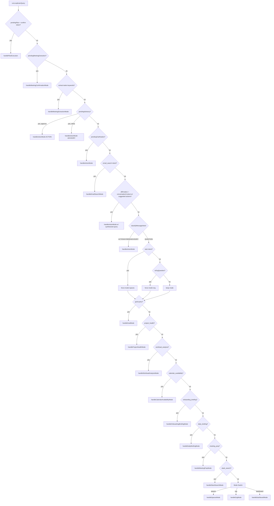
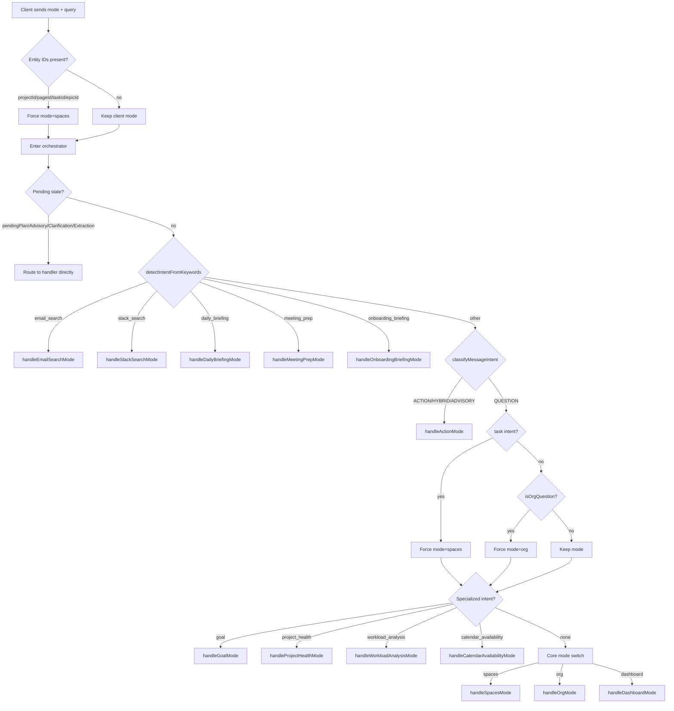

# Loopbrain Architecture Audit — 2026-03-02

> **Methodology:** Every finding cites file paths and line numbers from the codebase at commit `ede32f7` (branch `integration/merge-stabilized`). No speculation — gaps are flagged as **NEEDS INVESTIGATION**.

---

## Section 1: File Inventory & Line Counts

### 1.1 Core Library — `src/lib/loopbrain/` (120 files, 48,470 lines)

| Lines | File | Purpose | Status |
|------:|------|---------|--------|
| 5391 | `orchestrator.ts` | Main query router + all mode handlers | Active — largest file, god-object risk |
| 1963 | `context-engine.ts` | Context retrieval engine (workspace/project/page/task/org/activity) | Active |
| 1309 | `insight-detector.ts` | Proactive insight detection + storage | Active |
| 1108 | `actions/executor.ts` | 8 org-action executors (task.assign, timeoff.create, etc.) | Active |
| 1105 | `workload-analysis.ts` | Person + team workload snapshot builder | Active |
| 942 | `scenarios/onboarding-briefing.ts` | Onboarding narrative generator (LLM) | Active |
| 935 | `entity-graph.ts` | Entity graph snapshot builder (nodes, links, maps) | Active |
| 926 | `agent/tool-registry.ts` | 18 registered tools + Zod schemas + implementations | Active |
| 915 | `context-sources/calendar.ts` | Calendar availability snapshot builder | Active |
| 887 | `org/buildOrgLoopbrainContextBundle.ts` | Org context bundle builder | Active |
| 857 | `scenarios/meeting-prep.ts` | Meeting prep brief generator (LLM) | Active |
| 828 | `reasoning/calendarAvailability.ts` | Calendar availability reasoning | Active |
| 808 | `reasoning/q3.ts` | Q3: "Who should work on this?" | Active |
| 797 | `reasoning/q4.ts` | Q4: "Do we have capacity?" | Active |
| 981 | `reasoning/proactiveInsights.ts` | Proactive insight contract + detection | Active |
| 768 | `reasoning/projectHealth.ts` | Project health snapshot builder | Active |
| 767 | `intent-router.ts` | Deterministic intent classification (24 intents) | Active |
| 714 | `scenarios/project-health-scanner.ts` | Multi-project health scanning | Active |
| 690 | `context-sources/slack.ts` | Slack context (Tier A: sync, Tier B: real-time) | Active |
| 679 | `contract/workloadAnalysis.v0.ts` | Workload analysis contract types | Active |
| 648 | `context-sources/capacity.ts` | Unified capacity snapshot builder | Active |
| 631 | `context-sources/gmail.ts` | Gmail context source (live fetch + rolling sync) | Active |
| 627 | `contract/proactiveInsight.v0.ts` | Proactive insight contract types | Active |
| 596 | `agent/planner.ts` | LLM planner (plan/clarify/advisory modes) | Active |
| 541 | `contract/projectHealth.v0.ts` | Project health contract types | Active |
| 515 | `contract/calendarAvailability.v0.ts` | Calendar availability contract types | Active |
| 490 | `scenarios/daily-briefing.ts` | Daily briefing generator (LLM) | Active |
| 462 | `reasoning/workloadAnswer.ts` | Workload answer envelope formatter | Active |
| 448 | `goals/goal-queries.ts` | Goal query handler + `isGoalQuestion()` | Active |
| 433 | `reasoning/calendarAvailabilityAnswer.ts` | Calendar availability answer formatter | Active |
| 431 | `context-types.ts` | Context type definitions (ContextType, ContextObject) | Active |
| 424 | `orgContextMapper.ts` | Org data → context object mapping | Active |
| 416 | `scenarios/briefing-data.ts` | Shared briefing data loaders | Active |
| 414 | `orgContextPersistence.ts` | Org context → ContextItem sync | Active |
| 413 | `org-bundle-expander.ts` | Expand org bundle by question type | Active |
| 407 | `errors.ts` | Loopbrain error types + `toLoopbrainError()` | Active |
| 381 | `reasoning/entityLinksAnswer.ts` | Entity link answer formatter | Active |
| 365 | `actions/__tests__/executor.org-actions.test.ts` | Org action executor tests (9 cases) | Active — test |
| 360 | `postProcessors/orgValidator.ts` | Org response hallucination validator | Active |
| 348 | `reasoning/projectHealthAnswer.ts` | Project health answer formatter | Active |
| 342 | `contract/entityLinks.v0.ts` | Entity links contract types | Active |
| 340 | `scenarios/meeting-task-extraction.ts` | Meeting task extraction via LLM | Active |
| 311 | `embedding-service.ts` | Embedding generation + semantic search | Active |
| 307 | `user-context.ts` | User context resolver (name, role, timezone) | Active |
| 301 | `orgContextBuilder.ts` | Org context bundle builder (legacy path) | Active |
| 300 | `orgQaService.ts` | Org QA service (debug/standalone path) | Active |
| 293 | `contract/goalIntelligence.v0.ts` | Goal intelligence contract types | Active |
| 284 | `indexing/builders/org.ts` | Org entity indexer | Active |
| 280 | `signals.ts` | Signal derivation for insights | Active |
| 279 | `context-ranker.ts` | Context relevance ranking | Active |
| 264 | `agent/context-builder.ts` | Planner context builder (projects, tasks, members, goals, epics) | Active |
| 263 | `event-listener.ts` | Event-driven context sync | Active |
| 262 | `answer-templates.ts` | Answer template definitions | Active |
| 254 | `contract/questions.v0.ts` | Loopbrain question definitions (Q1–Q9) | Active |
| 252 | `q9.ts` | Q9: "Proceed, reassign, delay, or request support?" | Active |
| 246 | `orchestrator-types.ts` | Orchestrator type definitions | Active |
| 245 | `indexing/indexer.ts` | Context item indexer | Active |
| 245 | `context-sources/slack-search.ts` | On-demand Slack search | Active |
| 234 | `store/embedding-repository.ts` | Embedding storage DAL | Active |
| 231 | `context/getUserTaskContext.ts` | User task context loader | Active |
| 229 | `client.ts` | Client-side API caller | Active |
| 228 | `orgContextHealth.ts` | Org context health checker | Active |
| 226 | `store/context-repository.ts` | ContextItem CRUD DAL | Active |
| 224 | `orgPromptContextBuilder.ts` | Org prompt context builder | Active |
| 218 | `personalization/profile.ts` | User personalization profile | Active |
| 211 | `org/buildOrgFewShotExamples.ts` | Org few-shot examples for prompt | Active |
| 209 | `world/openLoops/deriveOpenLoops.ts` | Open loop derivation | Active |
| 200 | `agent/executor.ts` | Agent plan executor (sequential step runner) | Active |
| 196 | `orgRelationsMapper.ts` | Org relation mapping | Active |
| 193 | `deriveSignals.ts` | Signal derivation | Active |
| 193 | `index.ts` | Barrel exports | Active |
| 186 | `context/getOrgSnapshotContext.ts` | Org snapshot context loader | Active |
| 177 | `org-question-types.ts` | Org question type inference | Active |
| 171 | `q6.ts` | Q6: "Who can cover if primary is unavailable?" | Active |
| 170 | `embedding-backfill.ts` | Embedding backfill utility | Active |
| 166 | `context-sources/gmail-search.ts` | On-demand Gmail search | Active |
| 166 | `client-helpers.ts` | Client-side helper functions | Active |
| 163 | `org-prompt-builder.ts` | Org prompt builder | Active |
| 160 | `answer-format.ts` | Answer format definitions | Active |
| 160 | `context-sources/pm/tasks.ts` | Task → ContextObject builder | Active |
| 157 | `postProcessors/orgReferencedContext.ts` | Org referenced context post-processor | Active |
| 157 | `org/buildOrgPromptSection.ts` | Org prompt section builder | Active |
| 148 | `citations.ts` | Citation extraction | Active |
| 148 | `slack-helper.ts` | Slack send/read wrapper | Active |
| 148 | `store/summary-repository.ts` | Summary storage DAL | Active |
| 142 | `org-context-reader.ts` | Org context reader | Active |
| 142 | `agent/types.ts` | Agent type definitions | Active |
| 140 | `perf-guardrails.ts` | Performance guardrails | Active |
| 131 | `actions/action-types.ts` | 8 action type schemas | Active |
| 124 | `types.ts` | Core type definitions | Active |
| 124 | `context-sources/pm/projects.ts` | Project → ContextObject builder | Active |
| 123 | `prompts/org-system-prompt.ts` | Org system prompt (122 lines of prompt text) | Active |
| 116 | `q7.ts` | Q7: "Is responsibility aligned with role?" | Active |
| 114 | `orgContextStatus.ts` | Org context status | Active |
| 111 | `context-sources/pm/epics.ts` | Epic → ContextObject builder | Active |
| 108 | `orgTelemetry.ts` | Org query telemetry | Active |
| 108 | `scenarios/create-extracted-tasks.ts` | Bulk task creation from extracted items | Active |
| 107 | `testing/normalize.ts` | Test normalization helpers | Active — test util |
| 105 | `orgContextForLoopbrain.ts` | Org context for Loopbrain | Active |
| 102 | `ensureOrgContextSynced.ts` | Preflight org context sync | Active |
| 98 | `request-cache.ts` | Request-level cache | Active |
| 98 | `orgSubContexts.ts` | Org sub-context loaders (headcount/reporting/risk) | Active |
| 88 | `orgQuestionPrompt.ts` | Org question prompt builder (legacy) | Active |
| 87 | `org-qa-questions.ts` | Org QA question definitions | Active |
| 87 | `contract/refusalCopy.v0.ts` | Refusal copy contract | Active |
| 83 | `actions/action-extractor.ts` | Action JSON extraction from LLM output | Active |
| 82 | `indexing/builders/epic.ts` | Epic indexer | Active |
| 79 | `request-id.ts` | Request ID generator | Active |
| 79 | `fixHistory.ts` | History fix utility | Active |
| 75 | `context-quality.ts` | Context quality scoring | Active |
| 75 | `listeners/orgContextListeners.ts` | Org context event listeners | Active |
| 74 | `org/telemetry.ts` | Org routing telemetry | Active |
| 74 | `q5.ts` | Q5: "Who is unavailable?" | Active |
| 72 | `org-qa-snapshot.ts` | Org QA snapshot builder | Active |
| 72 | `orgStatus.ts` | Org status helper | Active |
| 71 | `indexing/builders/leave-request.ts` | Leave request indexer | Active |
| 71 | `indexing/builders/page.ts` | Wiki page indexer | Active |
| 70 | `indexing/builders/project.ts` | Project indexer | Active |
| 70 | `freshness.ts` | Context freshness scoring | Active |
| 69 | `indexing/builders/task.ts` | Task indexer | Active |
| 67 | `org/isOrgQuestion.ts` | Org question detector | Active |
| 66 | `impact.ts` | Impact scoring | Active |
| 65 | `contract/refusalActions.v0.ts` | Refusal action contract | Active |
| 64 | `indexing/builders/time-off.ts` | Time-off indexer | Active |
| 63 | `impactPreview.ts` | Impact preview | Active |
| 62 | `orgQuestionType.ts` | Org question type detection | Active |
| 60 | `contract/validateAnswerEnvelope.ts` | Answer envelope validator | Active |
| 59 | `org/buildOrgSystemAddendum.ts` | Org system addendum prompt block | Active |
| 55 | `orgQueryLogger.ts` | Org query logger | Active |
| 51 | `q2.ts` | Q2: "Who decides this?" | Active |
| 47 | `q8.ts` | Q8: "Is responsibility clear or fragmented?" | Active |
| 46 | `orgLlmClient.ts` | Org LLM client (lightweight, temp=0.2) | Active |
| 46 | `prompt-budgets.ts` | Prompt budget constants | Active |
| 45 | `promptBlocks/orgGuardrails.ts` | Org guardrails prompt block | Active |
| 43 | `org/types.ts` | Org type definitions | Active |
| 43 | `org-qa-types.ts` | Org QA types | Active |
| 41 | `store/index.ts` | Store barrel exports | Active |
| 40 | `orgStatus.ts` | Org status | Active |
| 39 | `world/openLoops/formatOpenLoopsForPrompt.ts` | Open loops prompt formatter | Active |
| 37 | `scripts/sync-goals.ts` | Goal sync script | Active |
| 34 | `config.ts` | Configuration constants | Active |
| 33 | `q1.ts` | Q1: "Who owns this?" | Active |
| 30 | `orgGate.ts` | Org Loopbrain feature gate | Active |
| 26 | `personalization/systemPrompt.ts` | System prompt personalizer | Active |
| 25 | `location.ts` | Location helper | Active |
| 24 | `world/openLoops/fetchOpenLoops.ts` | Open loops fetcher | Active |
| 23 | `context/getMemberRole.ts` | Member role helper | Active |
| 23 | `contextTypes.ts` | Context type re-export | Active |
| 22 | `orgIds.ts` | Org ID helpers | Active |
| 169 | `__tests__/loopbrain.snapshots.test.ts` | Snapshot tests (requires live server) | Active — test |
| 244 | `__tests__/personalization.test.ts` | Personalization tests | Active — test |
| 82 | `org-qa-summary.ts` | Org QA summary builder | Active |

**Dead code: None identified.** All 120 files are imported by at least one consumer.

### 1.2 API Routes — `src/app/api/loopbrain/` (36 files, 4,343 lines)

| Lines | Route | Methods |
|------:|-------|---------|
| 216 | `/chat` | POST |
| 143 | `/actions` | POST |
| 86 | `/availability` | GET |
| 75 | `/capacity` | GET |
| 52 | `/capacity/[userId]` | GET |
| 199 | `/context` | GET |
| 189 | `/entity-graph` | GET, POST |
| 126 | `/feedback` | POST |
| 257 | `/index-health` | GET |
| 136 | `/insights/dismiss` | POST |
| 258 | `/insights` | GET, POST |
| 143 | `/org/ask` | POST |
| 97 | `/org/context/bundle` | GET |
| 121 | `/org/context/status` | GET |
| 208 | `/org/context/sync` | POST |
| 72 | `/org/debug` | GET |
| 66 | `/org/prompt-compose` | POST |
| 32 | `/org/prompt-debug` | GET |
| 58 | `/org/q3` | POST |
| 232 | `/org/q4` | GET, POST |
| 84 | `/org/qa/run/[id]` | POST |
| 44 | `/org/qa/smoke` | GET |
| 58 | `/org/qna/history` | GET |
| 101 | `/org/qna` | POST |
| 77 | `/project-health/[projectId]` | GET |
| 211 | `/project-health` | GET, POST |
| 113 | `/q1` | GET |
| 115 | `/q2` | GET |
| 111 | `/q5` | GET |
| 167 | `/q6` | GET |
| 122 | `/q7` | GET |
| 96 | `/q8` | GET |
| 180 | `/q9` | GET |
| 163 | `/search` | POST |
| 59 | `/workload/[userId]` | GET |
| 83 | `/workload` | GET |

### 1.3 UI Components — `src/components/loopbrain/` (14 files, 3,891 lines)

| Lines | File | Purpose |
|------:|------|---------|
| 1165 | `assistant-panel.tsx` | Main chat panel (message history, plan/clarify/advisory/extraction flows) |
| 432 | `ProjectHealthCard.tsx` | Project health metrics display |
| 309 | `MeetingTaskReview.tsx` | Editable extracted-task checklist |
| 292 | `execution-progress.tsx` | Animated plan execution progress |
| 282 | `OnboardingBriefing.tsx` | Multi-section onboarding briefing |
| 225 | `MeetingPrepBrief.tsx` | Meeting prep display |
| 195 | `advisory-suggestion.tsx` | Advisory mode tree view |
| 194 | `assistant-context.tsx` | React context provider (state persistence) |
| 188 | `OrgContextSyncButton.tsx` | Admin sync trigger |
| 153 | `clarifying-questions.tsx` | Clarifying question UI with suggestion pills |
| 147 | `plan-confirmation.tsx` | Plan step display with confirm/cancel |
| 122 | `QuickAskResult.tsx` | Inline quick-ask result |
| 115 | `BlockedAnswerNotice.tsx` | Org readiness blocker card |
| 72 | `assistant-launcher.tsx` | Floating toggle button |

### 1.4 Integration Libraries — `src/lib/integrations/` (6 files, 1,956 lines)

| Lines | File | Purpose |
|------:|------|---------|
| 565 | `slack-service.ts` | Core Slack API wrapper |
| 485 | `slack/interactive.ts` | Slack interactive message handling |
| 322 | `slack/notify.ts` | Slack notification sender |
| 269 | `slack-interactive.ts` | Slack interactive (legacy) |
| 183 | `calendar-events.ts` | Google Calendar event creation |
| 132 | `gmail-send.ts` | Gmail send/reply |

### 1.5 Integration API Routes

| Lines | Route | Methods |
|------:|-------|---------|
| 103 | `/api/integrations/gmail/callback` | GET |
| 100 | `/api/integrations/gmail/messages` | GET |
| 74 | `/api/integrations/gmail/archive` | POST |
| 63 | `/api/integrations/gmail/debug` | GET |
| 60 | `/api/integrations/gmail/send` | POST |
| 50 | `/api/integrations/gmail/status` | GET |
| 43 | `/api/integrations/gmail/connect` | GET |
| 65 | `/api/integrations/calendar/events/create` | POST |

**Grand total: 120 lib files (48,470 lines) + 36 API routes (4,343 lines) + 14 UI components (3,891 lines) + 6 integration libs (1,956 lines) + 8 integration routes (558 lines) = 59,218 lines.**

### 1.6 External Consumers (files outside loopbrain/ that import from it)

**~87 files** import from `src/lib/loopbrain/`:
- 16 UI components in `src/components/loopbrain/`
- 10+ org UI components (`OrgChartLoopbrainPanel`, `TeamLoopbrainPanel`, `PersonRolesCard`, etc.)
- 8 app pages/layouts
- 40+ API routes (loopbrain, org, dev, cron, internal)
- 12+ server/lib files (goals, context, org intelligence, events, socket server)

---

## Section 2: Request Flow — Every Code Path

### 2.1 Chat Route Entry (`src/app/api/loopbrain/chat/route.ts`)

```
POST /api/loopbrain/chat
├─ Auth: getUnifiedAuth(request) → assertAccess({ requireRole: ['MEMBER'] })
├─ Parse body: { mode, query, projectId?, pageId?, taskId?, epicId?, roleId?,
│                teamId?, personId?, useSemanticSearch?, maxContextItems?,
│                sendToSlack?, slackChannel?, clientMetadata?, slackChannelHints?,
│                pendingPlan?, conversationContext?, pendingClarification?,
│                pendingAdvisory?, pendingMeetingExtraction? }
├─ Validate: mode ∈ {spaces, org, dashboard}, query non-empty
├─ Mode fix: if any entity ID present → force mode='spaces'
├─ Org gate: if mode='org' → check isOrgLoopbrainEnabled(), run ensureOrgContextSyncedSync()
├─ Build LoopbrainRequest (workspaceId/userId from auth, never client)
└─ runLoopbrainQuery(request) → NextResponse.json(result)
```

**Note:** No Zod validation on body — uses manual type checks (line 97-118). No `setWorkspaceContext()` call.

### 2.2 Orchestrator Decision Tree (`src/lib/loopbrain/orchestrator.ts:159-412`)



### 2.3 Intent Router (`src/lib/loopbrain/intent-router.ts`)

**`detectIntentFromKeywords(queryLower)`** — priority-ordered keyword matching, 24 intents:

| Priority | Intent | Confidence | Trigger Phrases |
|----------|--------|-----------|-----------------|
| 1 | `email_search` | 0.90 | "email about", "email from", "check my inbox", "search my gmail" |
| 2 | `slack_search` | 0.90 | "in slack", "slack channel", "check slack", `#channel` |
| 3 | `extract_tasks` | 0.92 | "extract tasks", "action items", "meeting tasks" |
| 4 | `daily_briefing` | 0.93 | "brief me", "catch me up", "what did i miss" |
| 5 | `meeting_prep` | 0.93 | "prep me", "meeting prep", "prepare for meeting" |
| 6 | `onboarding_briefing` | 0.93 | "get me up to speed", "onboard me" |
| 7-24 | task/goal/project/capacity/etc. | 0.75-0.90 | Various |

**`classifyMessageIntent(message)`** — deterministic, no LLM:

1. Short affirmative regex → `ACTION`
2. Advisory signals ("how should i", "suggest", "brainstorm") → `ADVISORY`
3. Both action + question words → `HYBRID`
4. Action verb detected → `ACTION`
5. Default → `QUESTION`

### 2.4 Mode Handlers — What Each Does

| Handler | Line | Context Loaded | LLM Call | Output |
|---------|------|---------------|----------|--------|
| `handleSpacesMode` | 444 | ContextObjects, personal docs, user tasks, Slack, Gmail, open loops, semantic search | Yes (gpt-4-turbo) | Markdown answer + suggestions |
| `handleOrgMode` | 782 | Org graph from ContextStore + legacy bundle, org snapshot, org health signals, semantic search | Yes (gpt-4-turbo, org model override) | Markdown answer + org validator |
| `handleDashboardMode` | 1136 | Workspace context, activity, Gmail, open loops, semantic search | Yes (gpt-4-turbo) | Markdown answer + suggestions |
| `handleGoalMode` | 4536 | Goal queries via `handleGoalQuery()`, entity graph | Yes (gpt-4-turbo) | Markdown answer + goal suggestions |
| `handleProjectHealthMode` | 4642 | Project health snapshot, entity graph | Yes (gpt-4-turbo) | Markdown answer + health suggestions |
| `handleWorkloadAnalysisMode` | 4764 | Workload analysis snapshot, entity graph | Yes (gpt-4-turbo) | Markdown answer + workload suggestions |
| `handleCalendarAvailabilityMode` | 4942 | Calendar availability snapshot, entity graph | Yes (gpt-4-turbo) | Markdown answer + availability suggestions |
| `handleEmailSearchMode` | 3263 | Gmail search results (or fallback to recent threads) | Yes (gpt-4-turbo) | Markdown answer + action detection |
| `handleSlackSearchMode` | 3433 | Slack message search results | Yes (gpt-4-turbo) | Markdown answer |
| `handleDailyBriefingMode` | 3059 | Tasks, calendar, project health, activity, Gmail, Slack | Yes (gpt-4-turbo, JSON output) | Structured DailyBriefing |
| `handleMeetingPrepMode` | 3131 | Meeting event, attendees, project context, Gmail, Slack | Yes (gpt-4-turbo, JSON output) | Structured MeetingPrepBrief |
| `handleOnboardingBriefingMode` | 3005 | User context, workspace, team, projects, governance | Yes (gpt-4-turbo, JSON output) | Structured OnboardingBriefing |
| `handleActionMode` | 5129 | Planner context (projects/tasks/members/goals/epics), Gmail (conditional), calendar (conditional) | Yes (gpt-4-turbo, JSON output) | Plan/Clarify/Advisory response |
| `handlePlanExecution` | 5365 | Confirmed plan steps | No LLM — tool execution only | Execution summary |
| `handleMeetingExtractionMode` | 3567 | User-provided meeting notes | Yes (gpt-4-turbo, JSON output) | Extracted tasks for review |
| `handleMeetingConfirmationMode` | 3658 | Confirmed extracted tasks | No LLM — bulk task creation | Creation results |

---

## Section 3: Context Injection Map

### 3.1 Context Source Details

| Context Source | File | Key Function | Data Format |
|---------------|------|-------------|-------------|
| **Gmail threads** | `context-sources/gmail.ts` | `loadGmailThreads()` | `GmailThreadSummary[]` (subject, from, date, bodyPreview, attachments) |
| **Gmail search** | `context-sources/gmail-search.ts` | `searchGmailForContext()` | `GmailSearchResult` (threads + formatted contextText) |
| **Calendar events** | `context-sources/calendar.ts` | `loadCalendarEvents()` | `CalendarEvent[]` (title, startTime, endTime, isAllDay) |
| **Calendar availability** | `context-sources/calendar.ts` | `buildCalendarAvailability()` | `CalendarAvailabilitySnapshotV0` (weekly pattern, forecast, conflicts) |
| **Capacity** | `context-sources/capacity.ts` | `buildUnifiedCapacity()` | `UnifiedCapacitySnapshotV0` (contract, allocations, calendar impact) |
| **Slack messages** | `context-sources/slack.ts` | `getSlackContextForProject()` | `SlackMessageSummary[]` with relevance scores |
| **Slack search** | `context-sources/slack-search.ts` | `searchSlackMessages()` | `SlackSearchResult` (messages + formatted contextText) |
| **Org graph** | `org/buildOrgLoopbrainContextBundle.ts` | `buildOrgLoopbrainContextBundleForWorkspace()` | Departments, teams, roles, people with relations |
| **Org snapshot** | `context/getOrgSnapshotContext.ts` | `getOrgSnapshotContext()` | `OrgSemanticSnapshotV0` (machine contract) |
| **Org ContextStore** | `org-context-reader.ts` | `fetchOrgContextSliceForWorkspace()` | ContextItem[] (department/team/role/person items) |
| **Wiki/pages** | `context-engine.ts` | `getWorkspaceContextObjects()` | `ContextObject[]` (pages, projects, tasks) |
| **Personal docs** | `context-engine.ts` | `getPersonalSpaceDocs()` | `ContextObject[]` (user's personal wiki pages) |
| **User tasks** | `context/getUserTaskContext.ts` | `getUserTaskContext()` | User's assigned tasks (context-enriched) |
| **Semantic search** | `embedding-service.ts` | `searchSimilarContextItems()` | Cosine-similarity ranked ContextItems |
| **Open loops** | `world/openLoops/deriveOpenLoops.ts` | `deriveOpenLoops()` | Tracked open items for proactive follow-up |
| **Entity graph** | `entity-graph.ts` | `getCachedEntityGraph()` | `EntityGraphSnapshotV0` (nodes + links) |
| **Project health** | `reasoning/projectHealth.ts` | `buildProjectHealthSnapshot()` | `ProjectHealthSnapshotV0` |
| **Workload** | `workload-analysis.ts` | `buildWorkloadAnalysis()` | `WorkloadAnalysisSnapshotV0` |
| **Goals** | `goals/goal-queries.ts` | `handleGoalQuery()` | Goal data + OKR progress |
| **Conversation history** | Client-side (`assistant-panel.tsx:242`) | `buildConversationContext()` | Last 6 messages as `"role: content"` lines |

### 3.2 Context Availability Matrix

| Context Source | Spaces | Org | Dashboard | Action | Email Search | Slack Search | Goal | Project Health | Workload | Calendar Avail. | Daily Briefing | Meeting Prep |
|---------------|--------|-----|-----------|--------|-------------|-------------|------|----------------|----------|-----------------|----------------|-------------|
| Gmail threads | **YES** | no | **YES** | **CONDITIONAL** | **YES** (search) | no | no | no | no | no | **YES** | **YES** |
| Calendar events | no | no | no | **CONDITIONAL** | no | no | no | no | no | **YES** | **YES** | **YES** |
| Slack context | **YES** | **YES** | **YES** | no | no | **YES** (search) | no | no | no | no | **YES** | **YES** |
| Org graph/bundle | no | **YES** | no | no | no | no | no | no | no | no | no | no |
| Org snapshot | no | **YES** | no | no | no | no | no | no | no | no | no | no |
| Wiki/pages ContextObjects | **YES** | no | **YES** | no | no | no | no | no | no | no | no | no |
| Personal docs | **YES** | no | no | no | no | no | no | no | no | no | no | no |
| User tasks | **YES** | no | no | no | no | no | no | no | no | no | **YES** | no |
| Semantic search | **YES** | **YES** | **YES** | no | no | no | no | no | no | no | no | no |
| Open loops | **YES** | no | **YES** | no | no | no | no | no | no | no | no | no |
| Entity graph | no | no | no | no | no | no | **YES** | **YES** | **YES** | **YES** | no | no |
| Planner context | no | no | no | **YES** | no | no | no | no | no | no | no | no |
| Conversation history | no | no | no | **YES** (to planner) | no | no | no | no | no | no | no | no |
| Project health snapshot | no | no | no | no | no | no | no | **YES** | no | no | **YES** | no |
| Workload snapshot | no | no | no | no | no | no | no | no | **YES** | no | no | no |
| Capacity snapshot | no | no | no | no | no | no | no | no | **YES** (via workload) | no | no | no |
| Goal data | no | no | no | no | no | no | **YES** | no | no | no | no | no |

### 3.3 Context Gaps

| Gap | Impact | Severity |
|-----|--------|----------|
| **Action mode has no semantic search** — planner gets projects/tasks/members/goals/epics from direct queries but no embedding-based retrieval | Planner may miss relevant wiki pages, historical context | Medium |
| **Action mode has no org context** — planner doesn't know org structure, teams, roles | Can't intelligently suggest assignees based on org hierarchy | Medium |
| **Org mode has no Gmail/calendar context** — can't answer "is Sarah available for a meeting?" in org mode | Forces mode switch to calendar_availability | Low |
| **Goal mode has no project health context** — can't correlate goal progress with project status | Missed insight opportunity | Low |
| **Email search mode has no calendar context** — can't connect email discussions to upcoming meetings | Minor UX gap | Low |
| **Spaces/Dashboard modes have no calendar context** — can't answer "what meetings do I have today?" | Triggers mode reclassification to daily_briefing or calendar_availability | Low |
| **Conversation history only sent to Action mode** — Spaces/Org/Dashboard LLM calls never see prior turns | Can't do multi-turn Q&A in non-action modes | **High** |

---

## Section 4: Tool Registry & Action Execution

### 4.1 Agent Tools (`src/lib/loopbrain/agent/tool-registry.ts`)

| # | Tool Name | Category | Confirms? | Implementation |
|---|-----------|----------|-----------|---------------|
| 1 | `createProject` | project | Yes | Prisma create Project |
| 2 | `createTask` | task | Yes | Prisma create ProjectTask |
| 3 | `createEpic` | project | Yes | Prisma create Epic |
| 4 | `assignTask` | task | Yes | Prisma update ProjectTask.assigneeId |
| 5 | `createTodo` | todo | Yes | Prisma create Todo |
| 6 | `createWikiPage` | wiki | Yes | Prisma create WikiPage (with slugify) |
| 7 | `createGoal` | goal | Yes | Prisma create Goal |
| 8 | `addPersonToProject` | project | Yes | Prisma create ProjectMember |
| 9 | `updateTaskStatus` | task | Yes | Prisma update status (sets completedAt for DONE) |
| 10 | `updateProject` | project | Yes | Prisma update (partial fields) |
| 11 | `linkProjectToGoal` | project | Yes | Prisma create ProjectGoalLink |
| 12 | `addSubtask` | task | Yes | Prisma create Subtask |
| 13 | `sendEmail` | email | Yes | Delegates to `sendGmail()` |
| 14 | `replyToEmail` | email | Yes | Delegates to `sendGmail()` with threadId/messageId |
| 15 | `createCalendarEvent` | calendar | Yes | Delegates to `createCalendarEvent()` |
| 16 | `createMultipleCalendarEvents` | calendar | Yes | Loops `createCalendarEvent()` (partial-success semantics) |
| 17 | `listProjects` | project | **No** | Read-only Prisma query |
| 18 | `listPeople` | org | **No** | Read-only Prisma query |

**All 18 tools are fully implemented.** Every write tool requires confirmation. Only 2 read-only tools skip confirmation.

### 4.2 Org Actions (`src/lib/loopbrain/actions/executor.ts`)

| # | Action Type | RBAC | Implementation |
|---|------------|------|---------------|
| 1 | `task.assign` | MEMBER+ (via `assertProjectAccess`) | Update task + index |
| 2 | `timeoff.create` | Self-only (MVP) | Create LeaveRequest (PENDING) + index |
| 3 | `capacity.request` | Team member OR ADMIN+ | Create task in "Requests" project + index |
| 4 | `org.assign_to_project` | Any member (implicit) | Upsert ProjectMember + allocation + index |
| 5 | `org.approve_leave` | Delegates to `processLeaveRequest` | Process leave request + index |
| 6 | `org.update_capacity` | ADMIN+ | Close old contract, create new contract + index |
| 7 | `org.assign_manager` | ADMIN+ | Create PersonManagerLink (idempotent) + index |
| 8 | `org.create_person` | ADMIN+ | Delegates to `createOrgPerson` + index |

**All 8 actions are fully implemented** with proper RBAC, error handling, and search indexing.

### 4.3 Two Execution Systems — Key Distinction

The codebase has **two parallel execution systems** that do NOT overlap:

1. **Agent tools** (18 tools): PM + email + calendar operations. Planned by the LLM planner, confirmed by user, executed sequentially with inter-step dependency resolution (`$stepN.data.FIELD`).

2. **Org actions** (8 actions): HR/org structure operations. Extracted from LLM output as `ACTIONS_JSON` blocks, confirmed by user, executed individually.

---

## Section 5: Conversation History & Memory

### 5.1 Client-Side Construction (`assistant-panel.tsx:242-246`)

```typescript
const buildConversationContext = (): string => {
  const recent = messages.slice(-6) // last 3 turns (user+assistant pairs)
  if (recent.length === 0) return ''
  return recent.map((m) => `${m.role}: ${m.content}`).join('\n')
}
```

- **Format:** `"user: ...\nassistant: ...\nuser: ...\nassistant: ..."` (plain text, newline-separated)
- **Window:** Last 6 messages (3 turn pairs)
- **Sent on:** Every request that involves plan confirmation, clarification answers, or regular messages via `callLoopbrainAssistant()`

### 5.2 Server-Side Usage

| Location | How Used |
|----------|----------|
| `orchestrator.ts:283-312` | Affirmative follow-up: parses last `Assistant:` message for action suggestions |
| `orchestrator.ts:5151` | Short affirmative detection: if affirmative + `conversationContext` mentions "email" → load Gmail |
| `orchestrator.ts:5189-5193` | Short affirmative detection: if affirmative + context mentions "schedule"/"calendar"/"lunch"/"meeting" → load calendar |
| `orchestrator.ts:5279` | Passed directly to `generatePlan()` |
| `agent/planner.ts:376-378` | Injected as `## Conversation history` in LLM user prompt |

### 5.3 Where Conversation Memory BREAKS

**The "yes, please do" problem:**

1. User asks: "Can you schedule a lunch meeting tomorrow?" → Routed to `handleActionMode` (ACTION intent) → Planner generates plan → Returns plan for confirmation
2. User says: "Yes" → `isShortAffirmative = true`, `conversationContext` includes prior exchange
3. **Path 1 (line 188-192):** If `pendingPlan` is set in the request body → `handlePlanExecution()` ✓ Works correctly
4. **Path 2 (line 282-312):** If `pendingPlan` is NOT set but `conversationContext` has action suggestions → Synthesizes new query, re-enters `handleActionMode` → **Re-plans from scratch** instead of executing the prior plan

**Root cause:** The client must explicitly pass `pendingPlan` back. If the UI state is lost (page refresh, panel close/reopen), the plan is gone and the affirmative fallback re-enters planning.

**Other memory gaps:**
- **Spaces/Org/Dashboard modes never receive `conversationContext`** in their LLM calls (only Action mode passes it to the planner). Multi-turn Q&A in these modes has no memory of prior turns.
- **Conversation history is truncated to 6 messages.** Long multi-step workflows lose earlier context.
- **No server-side conversation store.** All state is client-side (`sessionStorage`). Closing the browser tab loses everything.

---

## Section 6: Mode Routing Logic

### 6.1 Mode Determination Algorithm

Mode is determined from **three sources** in priority order:

1. **Client-specified mode** (`body.mode` from POST body): `spaces`, `org`, or `dashboard`
2. **Entity ID override** (`chat/route.ts:122-125`): If `projectId`, `pageId`, `taskId`, or `epicId` → force `spaces`
3. **Orchestrator intent override** (`orchestrator.ts:335-395`): Intent classification can override mode:
   - Task intents → force `spaces`
   - `isOrgQuestion()` true → force `org`
   - Specialized intents → dedicated mode handlers (bypass core mode switch entirely)

### 6.2 Mode Selection Flowchart



### 6.3 "Org Routing FALLBACK"

The "Org Routing FALLBACK" appears when:
1. Client sends `mode=spaces` or `mode=dashboard`
2. `isOrgQuestion(query)` at `orchestrator.ts:346` returns `true`
3. Mode is overridden to `org`
4. Telemetry records this as `OrgRoutingEvent` with `source: 'fallback'` via `recordOrgRoutingEvent()` (`org/telemetry.ts`)

### 6.4 email_search vs Agent Path

| Condition | Route |
|-----------|-------|
| `detectIntentFromKeywords` returns `email_search` (confidence 0.90) | `handleEmailSearchMode` — read-only search/analysis, no actions |
| `classifyMessageIntent` returns `ACTION` and query mentions email | `handleActionMode` — planner builds send/reply plan with Gmail tools |
| Short affirmative + prior conversation about email | `handleActionMode` — re-enters planning with Gmail context injected |

The key difference: **email_search** is for reading/searching email ("what did Sarah email about?"). **Action mode** is for writing email ("reply to Sarah's email saying...").

---

## Section 7: LLM Calls

### 7.1 Central Gateway

All Loopbrain LLM calls go through `callLoopbrainLLM()` (`orchestrator.ts:3716`):

```typescript
export async function callLoopbrainLLM(
  prompt: string,
  systemPrompt?: string,
  options?: { model?: string; maxTokens?: number; timeoutMs?: number }
)
```

- **Default model:** `process.env.LOOPBRAIN_MODEL || 'gpt-4-turbo'`
- **Default system prompt:** `'You are Loopbrain, Loopwell\'s Virtual COO assistant.'`
- **Temperature:** 0.7 (hardcoded)
- **Streaming:** No — all calls are non-streaming

### 7.2 All LLM Call Sites (21 calls)

| # | Handler | Model | System Prompt | maxTokens | Output Format |
|---|---------|-------|--------------|-----------|---------------|
| 1 | `handleSpacesMode` | gpt-4-turbo | Personalized "Virtual COO in Spaces mode" | default | Markdown |
| 2 | `handleOrgMode` (org-specific) | `LOOPBRAIN_ORG_MODEL` or gpt-4-turbo | ORG_SYSTEM_PROMPT + addendum + few-shot + guardrails | 700 (`LOOPBRAIN_ORG_MAX_TOKENS`) | Markdown (validated) |
| 3 | `handleOrgMode` (generic fallback) | gpt-4-turbo | ORG_SYSTEM_PROMPT only | default | Markdown |
| 4 | `handleDashboardMode` | gpt-4-turbo | Personalized default system prompt | default | Markdown |
| 5 | `handleEmailSearchMode` | gpt-4-turbo | Personalized + email analysis instructions | default | Markdown |
| 6 | `handleSlackSearchMode` | gpt-4-turbo | Personalized + Slack analysis instructions | default | Markdown |
| 7-8 | Slack message summarization (×2) | gpt-4-turbo | Default fallback | default | Free text |
| 9 | `handleGoalMode` | gpt-4-turbo | Custom with goal data JSON | default | Markdown |
| 10 | `handleProjectHealthMode` | gpt-4-turbo | Custom with health snapshot JSON | default | Markdown |
| 11 | `handleWorkloadAnalysisMode` | gpt-4-turbo | Custom with workload data JSON | default | Markdown |
| 12 | `handleTeamWorkloadQuery` | gpt-4-turbo | Custom with team workload JSON | default | Markdown |
| 13 | `handleCalendarAvailabilityMode` | gpt-4-turbo | Custom with availability data JSON | default | Markdown |
| 14 | `handleTeamAvailabilityQuery` | gpt-4-turbo | Custom with team availability JSON | default | Markdown |
| 15 | Agent planner (`generatePlan`) | gpt-4-turbo | 360-line planner system prompt | 4000 | Strict JSON (Zod-validated) |
| 16 | `generateDailyBriefing` | gpt-4-turbo | `DAILY_BRIEFING_SYSTEM_PROMPT` | 2000 | JSON (greeting, sections, keyActions) |
| 17 | `generateMeetingPrep` | gpt-4-turbo | `MEETING_PREP_SYSTEM_PROMPT` | 2000 | JSON (suggestedTopics, summary) |
| 18 | `generateOnboardingBriefing` | gpt-4-turbo | Onboarding system prompt | 2000 | JSON (5-section briefing) |
| 19 | `extractTasksFromMeetingNotes` | gpt-4-turbo | Inline extraction prompt | 3000 | JSON (tasks array) |
| 20 | `orgQaService.runOrgQa` | gpt-4o-mini (config.ts) | ORG_SYSTEM_PROMPT + full chain | 700 | Markdown (validated) |
| 21 | `orgLlmClient.runOrgQuestionLLM` | gpt-4o-mini | Parameterized | 1000 | Free text |

### 7.3 Embedding Service

- **Model:** `text-embedding-3-small` (OpenAI, 1536 dimensions)
- **File:** `embedding-service.ts`
- **Uses:** Direct `openai.embeddings.create()` — not through `callLoopbrainLLM`
- **Purpose:** Generate embeddings for ContextItems, semantic search via cosine similarity

### 7.4 No Streaming

**No Loopbrain pipeline uses streaming.** The streaming infrastructure exists in `src/lib/ai/providers.ts` (`generateAIStream`, `OpenAIProvider.generateStream`) but is never called by Loopbrain. All responses are buffered.

---

## Section 8: Known Issues & Bugs

### 8.1 Dead Code Paths

| Location | Issue |
|----------|-------|
| `orchestrator.ts` — `_detectOrgQuestionType()` | Prefixed with `_`, deprecated heuristic classifier. Still present but never called. |
| `orchestrator.ts` — `_detectAndSendSlackFromResponse()` | Prefixed with `_`, deprecated. Comment says "no longer called." |
| `intent-router.ts:496-623` — `selectModeFromIntent()` fallback logic for `capacity_planning` | The `availableContextHints` parameter is never populated by callers — always uses defaults |

### 8.2 Unreachable Branches

| Location | Issue |
|----------|-------|
| `orchestrator.ts:400-412` mode switch `default` | Throws error "Unknown mode" — but the chat route already validates mode ∈ {spaces, org, dashboard}, so this is defensive only |

### 8.3 Missing Error Handling

| Location | Issue | Severity |
|----------|-------|----------|
| Chat route (`chat/route.ts`) | No `setWorkspaceContext()` call — Prisma queries inside the orchestrator may not be workspace-scoped if they rely on the middleware | Medium |
| `handleActionMode` (`orchestrator.ts:5136`) | `workspaceSlug` hardcoded to `''` — tools needing workspace slug will get empty string | Low |
| `loopbrain/context` route | No `handleApiError()` — raw error objects may leak | Low |
| `loopbrain/search` route | No `handleApiError()` | Low |
| `loopbrain/feedback` route | No `handleApiError()` | Low |
| `gmail/debug` route | No production guard despite comment suggesting one | Medium |

### 8.4 Context Loaded but Never Used

| Location | Issue |
|----------|-------|
| `handleSpacesMode` loads `openLoops` via `fetchOpenLoops` + `formatOpenLoopsForPrompt` | Appended to prompt but the open-loops feature is incomplete — `deriveOpenLoops()` is called at orchestrator entry (line 173) but the derivation logic has limited data sources |

### 8.5 The Affirmative Follow-Up Routing Gap

**Current state** (`orchestrator.ts:282-312`):

1. When user sends a short affirmative ("yes", "do it", "go ahead"):
2. The orchestrator checks `conversationContext` for the last `Assistant:` message
3. It scans for action suggestion patterns: `schedule`, `would you like me to`, `want me to`, `I can`, `set up`, `create`, `here's what`, `actionable items`
4. If found, it extracts numbered/bulleted items and synthesizes: `"User confirmed. Execute these actions:\n{items}"`
5. Routes to `handleActionMode` with the synthesized query

**Problems:**
- Pattern matching is brittle — depends on exact LLM output format
- If the LLM phrased its suggestion differently, the regex won't match
- The synthesized query re-enters planning from scratch (new LLM call) instead of executing the prior plan
- `pendingPlan` state is only available if the client explicitly sends it back — page refresh loses it
- **No fallback**: if affirmative detection fails, the "yes" goes to `classifyMessageIntent` → `ACTION` → `handleActionMode` with just "yes" as the query — which produces a nonsensical plan

### 8.6 Race Conditions

| Location | Issue | Severity |
|----------|-------|----------|
| `deriveOpenLoops()` at orchestrator entry (line 173) | Fires on every query, no mutex — concurrent requests could derive simultaneously | Low (idempotent) |
| Gmail sync cooldown check in `syncGmailContext` | Reads `lastSyncAt` → processes → updates. No transaction lock — two concurrent syncs could both pass the cooldown check | Low (worst case: duplicate sync) |

### 8.7 Missing `setWorkspaceContext` in Routes

The following routes lack `setWorkspaceContext()` — Prisma queries may not be workspace-scoped:

| Route | Risk |
|-------|------|
| `/api/loopbrain/chat` | **High** — main entry point; orchestrator makes many Prisma calls |
| `/api/loopbrain/actions` | Medium — action executor sets context per-action |
| `/api/loopbrain/context` | Medium — context engine queries |
| `/api/loopbrain/search` | Medium — embedding search |
| `/api/loopbrain/feedback` | Low — creates feedback record |
| `/api/loopbrain/q5` | Low — Q5 pipeline |
| `/api/loopbrain/org/q3` | Low — Q3 pipeline |
| `/api/loopbrain/org/q4` | Low — Q4 pipeline |
| `/api/integrations/gmail/connect` | Low — redirect only |
| `/api/integrations/gmail/send` | Medium — email send |

**Note:** `WORKSPACE_SCOPING_ENABLED` defaults to `false`, so `setWorkspaceContext()` is currently a no-op unless explicitly enabled. When scoping is enabled, these routes will break.

### 8.8 Zod Validation Gaps

Only **5 of 55** loopbrain-related routes use Zod validation:
- `/api/loopbrain/actions` (LoopbrainActionSchema)
- `/api/loopbrain/insights/dismiss` (dismissRequestSchema)
- `/api/integrations/gmail/send` (GmailSendSchema)
- `/api/integrations/gmail/archive` (GmailArchiveSchema)
- `/api/integrations/calendar/events/create` (CalendarEventCreateIntegrationSchema)

The main `/api/loopbrain/chat` route uses manual type checks.

---

## Section 9: Current State Summary Table

| Capability | Status | Code Path | Issues |
|-----------|--------|-----------|--------|
| **Email reading (check inbox)** | Working | `email_search` intent → `handleEmailSearchMode` → `searchGmailForContext()` or `loadGmailThreads()` fallback | Requires Gmail OAuth connected; fallback to recent 10 threads if search returns 0 |
| **Email sending** | Working | ACTION intent → `handleActionMode` → planner → `sendEmail` tool → `sendGmail()` | Requires plan confirmation; planner must generate correct params |
| **Email reply** | Working | ACTION intent → `handleActionMode` → planner → `replyToEmail` tool → `sendGmail()` with threadId | Requires Gmail context injection to have threadId/messageId available |
| **Calendar reading** | Working | `calendar_availability` intent → `handleCalendarAvailabilityMode` → `buildCalendarAvailability()` | Uses NextAuth Account table (different from Gmail's Integration model) |
| **Calendar event creation** | Working | ACTION intent → `handleActionMode` → planner → `createCalendarEvent` tool → `createCalendarEvent()` | Calendar context conditionally injected only when keywords match |
| **Calendar batch creation** | Working | ACTION intent → planner → `createMultipleCalendarEvents` tool | Partial-success semantics (some events may succeed, others fail) |
| **Task assignment** | Working (2 paths) | Path 1: Agent tool `assignTask` via planner. Path 2: Org action `task.assign` via action executor | Agent tool: MEMBER+. Org action: project-level access check |
| **Task creation** | Working | ACTION intent → planner → `createTask` tool | Requires projectId (planner must identify or user must specify) |
| **Leave management** | Working | Org action `timeoff.create` (create), `org.approve_leave` (approve/deny) | Self-only for creation (MVP). Approve/deny delegates to `processLeaveRequest` |
| **Capacity analysis** | Working | `workload_analysis` intent → `handleWorkloadAnalysisMode` → `buildWorkloadAnalysis()` | Supports both person and team level |
| **Org questions (Q1-Q9)** | Working | Direct API routes (`/api/loopbrain/q1` through `/q9`) + org mode handler | Q-series uses `orgId || workspaceId` fallback (P1 migration issue) |
| **Wiki search** | Working | Spaces mode → semantic search via embeddings + ContextObject retrieval | Depends on context items being indexed |
| **Project queries** | Working | Spaces mode with projectId anchor → structured context + semantic search | Also available via `project_health` intent |
| **Proactive suggestions** | Working | `detectInsights()` → cron job or POST `/api/loopbrain/insights` | Stored in ProactiveInsight table; dismissable |
| **Daily briefing** | Working | `daily_briefing` intent → `handleDailyBriefingMode` → `generateDailyBriefing()` | Structured JSON output rendered by `DailyBriefingCard` |
| **Meeting prep** | Working | `meeting_prep` intent → `handleMeetingPrepMode` → `generateMeetingPrep()` | Supports explicit event, title match, or next-meeting |
| **Follow-up confirmations** | **Partially working** | `pendingPlan` → `handlePlanExecution()` | Works when client sends `pendingPlan` back. **Breaks on page refresh.** Affirmative fallback re-plans from scratch. See Section 8.5. |
| **Multi-step conversations** | **Partially working** | `conversationContext` (last 6 messages) sent to Action mode only | **Not available in Spaces/Org/Dashboard modes.** Truncated at 6 messages. No server-side persistence. See Section 5.3. |
| **Onboarding briefing** | Working | `onboarding_briefing` intent → `handleOnboardingBriefingMode` → `generateOnboardingBriefing()` | Structured 5-section briefing with action checklist |
| **Meeting task extraction** | Working | Extract-tasks keywords → `handleMeetingExtractionMode` → LLM extraction → user review → bulk creation | Full flow: extract → review → confirm → create |
| **Slack search** | Working | `slack_search` intent → `handleSlackSearchMode` → `searchSlackMessages()` | Client-side keyword filtering (no `search:read` scope) |
| **Slack read/send** | Working | Pre-processed in Spaces/Org/Dashboard modes via `preprocessSlackReadRequest()` / `preprocessSlackRequest()` | `[SLACK_SEND:channel]message` and `[SLACK_READ:channel]` commands in LLM output |
| **Project health** | Working | `project_health` intent → `handleProjectHealthMode` → `buildProjectHealthSnapshot()` | Requires projectId; multi-project via POST `/api/loopbrain/project-health` |
| **Advisory mode** | Working | ADVISORY intent → `handleActionMode` → planner returns advisory with `suggestedStructure` | "Set it up" → converts to ACTION plan; "Adjust" → re-enters advisory |

---

## Section 10: Token Storage Architecture Split

| Integration | Token Storage | Table | Key Pattern |
|-------------|--------------|-------|-------------|
| **Gmail** (read + send) | `Integration.config.users[userId]` | `Integration` (workspace-scoped) | `{ type: 'GMAIL', workspaceId }` → `config.users.{userId}.tokens` |
| **Google Calendar** (read + create) | `Account.access_token` + `Account.refresh_token` | `Account` (NextAuth, user-scoped) | `{ userId, provider: 'google' }` |
| **Slack** | `Integration.config.botToken` | `Integration` (workspace-scoped) | `{ type: 'SLACK', workspaceId }` |

**This split is intentional** but creates maintenance complexity — two different token refresh patterns, two different scoping models.

---

## Section 11: Architectural Observations

### 11.1 God Object Risk

`orchestrator.ts` at **5,391 lines** contains 15+ mode handlers, all prompt builders, all Slack pre/post-processing, and all suggestion builders. This is the single largest risk to maintainability. Extracting mode handlers into individual files (e.g., `handlers/spaces.ts`, `handlers/org.ts`) would reduce cognitive load without changing behavior.

### 11.2 No Streaming

All 21 LLM calls are non-streaming. For a chat interface, this means the user sees no output until the full response is generated. Given that `gpt-4-turbo` responses can take 5-15 seconds, this is a significant UX gap.

### 11.3 Model Selection

The default model `gpt-4-turbo` is used for 19 of 21 calls. Two org-specific calls use `gpt-4o-mini` for cost optimization. There's no evidence of model selection based on query complexity or response time requirements.

### 11.4 Test Coverage

Only **3 test files** exist in `src/lib/loopbrain/`:
- `__tests__/loopbrain.snapshots.test.ts` (169 lines) — requires live server
- `__tests__/personalization.test.ts` (244 lines) — unit tests
- `actions/__tests__/executor.org-actions.test.ts` (365 lines) — 9 test cases

**The orchestrator, intent router, planner, tool registry, context sources, and all 15 mode handlers have zero test coverage.**

### 11.5 Auth Pattern Inconsistencies

| Pattern | Count | Notes |
|---------|-------|-------|
| Full canonical (getUnifiedAuth → assertAccess → setWorkspaceContext) | ~25 | Best practice |
| getUnifiedAuth → assertAccess (no setWorkspaceContext) | ~13 | Missing workspace scoping |
| Dev-only guard (no auth) | 10 | Acceptable for dev-only |
| Reordered (setWorkspaceContext before assertAccess) | 5 | Q1, Q2, Q6, Q7, Q8 |

---

*Audit completed 2026-03-02. Total analyzed: 59,218 lines across 184 files.*
