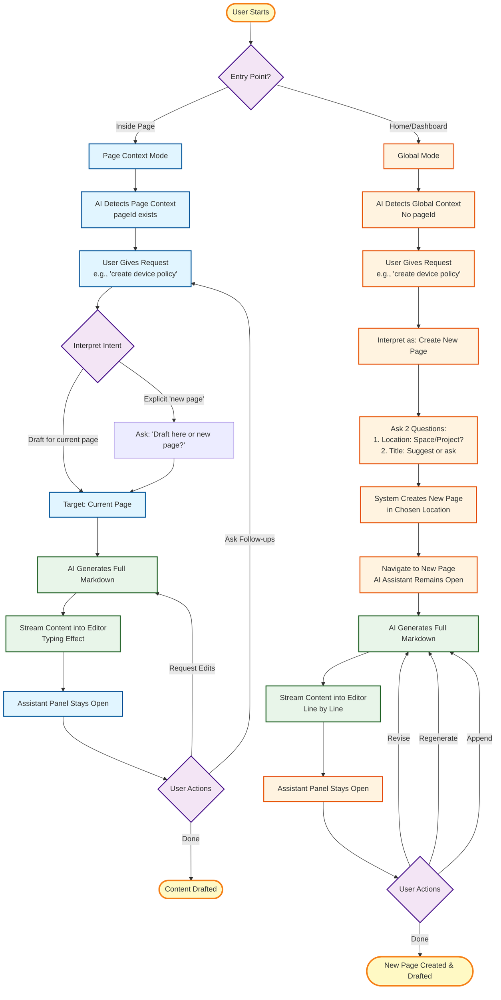
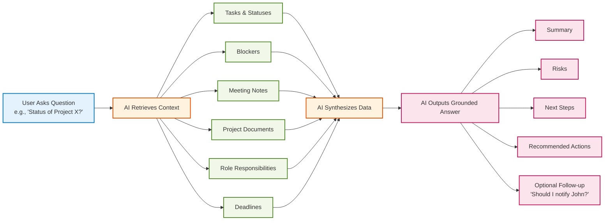
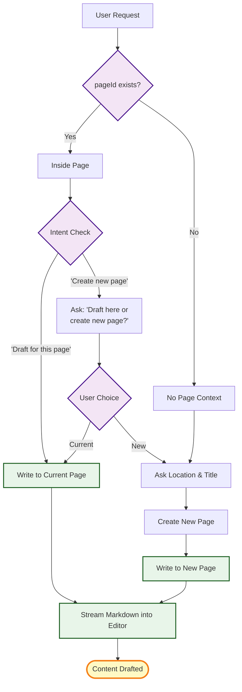
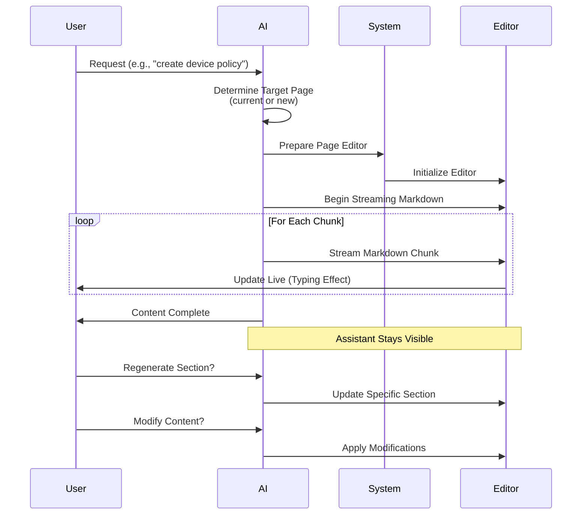
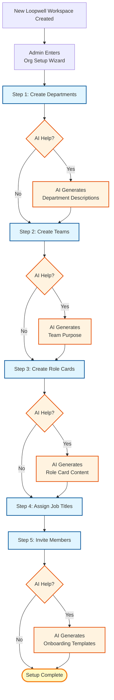
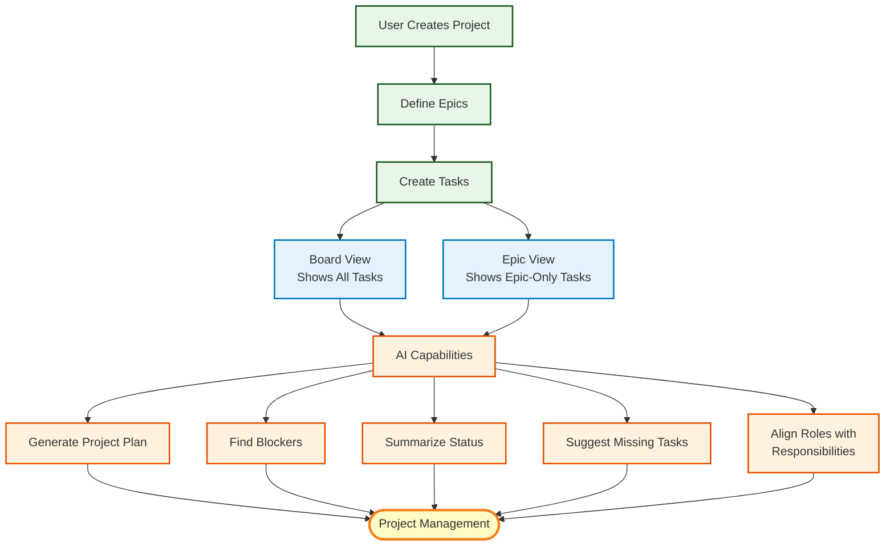
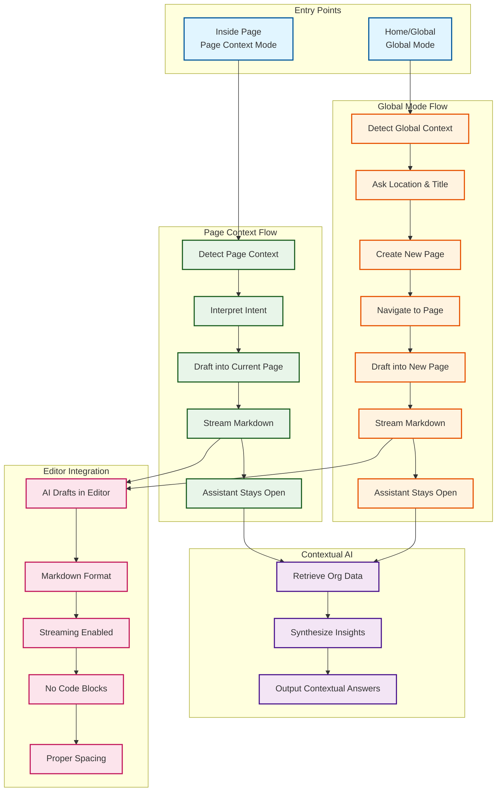

# Loopwell System Flow - Visual Diagram

## Overview
This document provides a comprehensive visual representation of the Loopwell AI Assistant system flow, showing how users interact with the AI in different contexts and how content is generated and managed.

## Main System Flow - ASCII Diagram

```
┌─────────────────────────────────────────────────────────────────────────────────────┐
│                              USER ENTRY POINTS                                     │
├──────────────────────────────────────┬────────────────────────────────────────────┤
│      Inside Page (Page Context)      │      Home/Dashboard (Global Mode)          │
└──────────────┬───────────────────────┴──────────────┬─────────────────────────────┘
               │                                      │
               ▼                                      ▼
┌─────────────────────────────────────────────────────────────────────────────────────┐
│                          PAGE CONTEXT MODE FLOW                                    │
├─────────────────────────────────────────────────────────────────────────────────────┤
│                                                                                     │
│  ┌──────────────────┐                                                              │
│  │ AI Detects Page  │                                                              │
│  │ Context (pageId) │                                                              │
│  └────────┬─────────┘                                                              │
│           │                                                                         │
│           ▼                                                                         │
│  ┌──────────────────┐                                                              │
│  │ User Gives       │                                                              │
│  │ Request          │                                                              │
│  │ e.g., "create    │                                                              │
│  │  device policy"  │                                                              │
│  └────────┬─────────┘                                                              │
│           │                                                                         │
│           ▼                                                                         │
│  ┌──────────────────┐                                                              │
│  │ Interpret Intent │                                                              │
│  └────────┬─────────┘                                                              │
│           │                                                                         │
│           ├─────────────────┐                                                      │
│           │                 │                                                      │
│           ▼                 ▼                                                      │
│  ┌──────────────┐   ┌──────────────────┐                                          │
│  │ Draft for    │   │ Explicit "new    │                                          │
│  │ current page │   │ page"? Ask:      │                                          │
│  │ (default)    │   │ "Draft here or   │                                          │
│  └──────┬───────┘   │ new page?"       │                                          │
│         │           └────────┬─────────┘                                          │
│         │                    │                                                      │
│         └──────────┬─────────┘                                                      │
│                    │                                                                 │
│                    ▼                                                                 │
│         ┌──────────────────┐                                                         │
│         │ Target: Current  │                                                         │
│         │ Page             │                                                         │
│         └────────┬─────────┘                                                         │
│                  │                                                                   │
│                  ▼                                                                   │
│         ┌──────────────────┐                                                         │
│         │ AI Generates     │                                                         │
│         │ Full Markdown    │                                                         │
│         └────────┬─────────┘                                                         │
│                  │                                                                   │
│                  ▼                                                                   │
│         ┌──────────────────┐                                                         │
│         │ Stream Content   │                                                         │
│         │ into Editor      │                                                         │
│         │ (Typing Effect)  │                                                         │
│         └────────┬─────────┘                                                         │
│                  │                                                                   │
│                  ▼                                                                   │
│         ┌──────────────────┐                                                         │
│         │ Assistant Panel  │                                                         │
│         │ Stays Open       │                                                         │
│         └────────┬─────────┘                                                         │
│                  │                                                                   │
│                  ▼                                                                   │
│         ┌──────────────────┐                                                         │
│         │ User Actions     │                                                         │
│         │ • Ask Follow-ups │                                                         │
│         │ • Request Edits  │                                                         │
│         │ • Done           │                                                         │
│         └────────┬─────────┘                                                         │
│                  │                                                                   │
│                  ▼                                                                   │
│         ┌──────────────────┐                                                         │
│         │ Content Drafted  │                                                         │
│         │ ✓                │                                                         │
│         └──────────────────┘                                                         │
│                                                                                     │
└─────────────────────────────────────────────────────────────────────────────────────┘

┌─────────────────────────────────────────────────────────────────────────────────────┐
│                           GLOBAL MODE FLOW                                         │
├─────────────────────────────────────────────────────────────────────────────────────┤
│                                                                                     │
│  ┌──────────────────┐                                                              │
│  │ AI Detects       │                                                              │
│  │ Global Context   │                                                              │
│  │ (No pageId)      │                                                              │
│  └────────┬─────────┘                                                              │
│           │                                                                         │
│           ▼                                                                         │
│  ┌──────────────────┐                                                              │
│  │ User Gives       │                                                              │
│  │ Request          │                                                              │
│  │ e.g., "create    │                                                              │
│  │  device policy"  │                                                              │
│  └────────┬─────────┘                                                              │
│           │                                                                         │
│           ▼                                                                         │
│  ┌──────────────────┐                                                              │
│  │ Interpret as:    │                                                              │
│  │ Create New Page  │                                                              │
│  └────────┬─────────┘                                                              │
│           │                                                                         │
│           ▼                                                                         │
│  ┌──────────────────┐                                                              │
│  │ Ask 2 Questions: │                                                              │
│  │ 1. Location:     │                                                              │
│  │    Space/Project?│                                                              │
│  │ 2. Title:        │                                                              │
│  │    Suggest/Ask   │                                                              │
│  └────────┬─────────┘                                                              │
│           │                                                                         │
│           ▼                                                                         │
│  ┌──────────────────┐                                                              │
│  │ System Creates   │                                                              │
│  │ New Page in      │                                                              │
│  │ Chosen Location  │                                                              │
│  └────────┬─────────┘                                                              │
│           │                                                                         │
│           ▼                                                                         │
│  ┌──────────────────┐                                                              │
│  │ Navigate to      │                                                              │
│  │ New Page         │                                                              │
│  │ (AI Assistant    │                                                              │
│  │  Remains Open)   │                                                              │
│  └────────┬─────────┘                                                              │
│           │                                                                         │
│           ▼                                                                         │
│  ┌──────────────────┐                                                              │
│  │ AI Generates     │                                                              │
│  │ Full Markdown    │                                                              │
│  └────────┬─────────┘                                                              │
│           │                                                                         │
│           ▼                                                                         │
│  ┌──────────────────┐                                                              │
│  │ Stream Content   │                                                              │
│  │ into Editor      │                                                              │
│  │ (Line by Line)   │                                                              │
│  └────────┬─────────┘                                                              │
│           │                                                                         │
│           ▼                                                                         │
│  ┌──────────────────┐                                                              │
│  │ Assistant Panel  │                                                              │
│  │ Stays Open       │                                                              │
│  └────────┬─────────┘                                                              │
│           │                                                                         │
│           ▼                                                                         │
│  ┌──────────────────┐                                                              │
│  │ User Actions     │                                                              │
│  │ • Revise         │                                                              │
│  │ • Regenerate     │                                                              │
│  │ • Append         │                                                              │
│  │ • Done           │                                                              │
│  └────────┬─────────┘                                                              │
│           │                                                                         │
│           ▼                                                                         │
│  ┌──────────────────┐                                                              │
│  │ New Page Created │                                                              │
│  │ & Drafted ✓      │                                                              │
│  └──────────────────┘                                                              │
│                                                                                     │
└─────────────────────────────────────────────────────────────────────────────────────┘
```

## Page Creation Decision Logic - ASCII Diagram

```
┌─────────────────────────────────────────────────────────────────────────────────────┐
│                        PAGE CREATION DECISION TREE                                  │
├─────────────────────────────────────────────────────────────────────────────────────┤
│                                                                                     │
│                              ┌──────────────┐                                       │
│                              │ User Request │                                       │
│                              └──────┬───────┘                                       │
│                                     │                                               │
│                                     ▼                                               │
│                            ┌─────────────────┐                                      │
│                            │ pageId exists?  │                                      │
│                            └────────┬────────┘                                      │
│                                     │                                               │
│                    ┌────────────────┴────────────────┐                            │
│                    │                                  │                            │
│                    ▼                                  ▼                            │
│          ┌─────────────────┐            ┌──────────────────┐                      │
│          │ Inside Page     │            │ No Page Context  │                      │
│          │ (Yes)           │            │ (No)             │                      │
│          └────────┬────────┘            └────────┬─────────┘                      │
│                   │                               │                                │
│                   ▼                               │                                │
│          ┌─────────────────┐                      │                                │
│          │ Intent Check    │                      │                                │
│          └────────┬────────┘                      │                                │
│                   │                               │                                │
│      ┌────────────┴────────────┐                  │                                │
│      │                         │                  │                                │
│      ▼                         ▼                  │                                │
│ ┌──────────────┐    ┌──────────────────┐         │                                │
│ │ "Draft for   │    │ "Create new      │         │                                │
│ │  this page"  │    │  page"?          │         │                                │
│ └──────┬───────┘    └────────┬─────────┘         │                                │
│        │                     │                    │                                │
│        │                     ▼                    │                                │
│        │            ┌──────────────────┐          │                                │
│        │            │ Ask User:        │          │                                │
│        │            │ "Draft here or   │          │                                │
│        │            │  create new?"    │          │                                │
│        │            └────────┬─────────┘          │                                │
│        │                     │                    │                                │
│        │                     ▼                    │                                │
│        │            ┌──────────────────┐          │                                │
│        │            │ User Choice     │          │                                │
│        │            └────────┬─────────┘          │                                │
│        │                     │                    │                                │
│        │         ┌───────────┴───────────┐        │                                │
│        │         │                       │        │                                │
│        │         ▼                       ▼        │                                │
│        │  ┌──────────────┐    ┌──────────────┐  │                                │
│        │  │ Current Page  │    │ Ask Location │  │                                │
│        │  └──────┬───────┘    └──────┬───────┘  │                                │
│        │         │                    │          │                                │
│        └─────────┼────────────────────┘          │                                │
│                  │                               │                                │
│                  │                               ▼                                │
│                  │                      ┌──────────────────┐                       │
│                  │                      │ Ask Location &   │                       │
│                  │                      │ Title            │                       │
│                  │                      └────────┬─────────┘                       │
│                  │                               │                                 │
│                  │                               ▼                                 │
│                  │                      ┌──────────────────┐                       │
│                  │                      │ Create New Page  │                       │
│                  │                      └────────┬─────────┘                       │
│                  │                               │                                 │
│                  │                               ▼                                 │
│                  │                      ┌──────────────────┐                       │
│                  │                      │ Write to New     │                       │
│                  │                      │ Page             │                       │
│                  │                      └────────┬─────────┘                       │
│                  │                               │                                 │
│                  └───────────────┬───────────────┘                                 │
│                                  │                                                 │
│                                  ▼                                                 │
│                         ┌──────────────────┐                                       │
│                         │ Write to Current │                                       │
│                         │ Page             │                                       │
│                         └────────┬─────────┘                                       │
│                                  │                                                 │
│                                  ▼                                                 │
│                         ┌──────────────────┐                                       │
│                         │ Stream Markdown  │                                       │
│                         │ into Editor      │                                       │
│                         └────────┬─────────┘                                       │
│                                  │                                                 │
│                                  ▼                                                 │
│                         ┌──────────────────┐                                       │
│                         │ Content Drafted  │                                       │
│                         │ ✓                │                                       │
│                         └──────────────────┘                                       │
│                                                                                     │
└─────────────────────────────────────────────────────────────────────────────────────┘
```

## Contextual AI Intelligence Flow - ASCII Diagram

```
┌─────────────────────────────────────────────────────────────────────────────────────┐
│                    CONTEXTUAL AI INTELLIGENCE FLOW                                  │
├─────────────────────────────────────────────────────────────────────────────────────┤
│                                                                                     │
│  ┌─────────────────────────────────────────────────────────────────────────────┐   │
│  │                         User Asks Question                                  │   │
│  │              e.g., "What's the status of Project X?"                        │   │
│  └──────────────────────────────┬──────────────────────────────────────────────┘   │
│                                 │                                                  │
│                                 ▼                                                  │
│                    ┌────────────────────────────┐                                 │
│                    │ AI Retrieves Context       │                                 │
│                    └────────────┬───────────────┘                                 │
│                                 │                                                  │
│         ┌───────────────────────┼───────────────────────┐                          │
│         │                       │                       │                          │
│         ▼                       ▼                       ▼                          │
│  ┌──────────────┐      ┌──────────────┐      ┌──────────────┐                   │
│  │ Tasks &      │      │ Blockers     │      │ Meeting      │                   │
│  │ Statuses     │      │              │      │ Notes        │                   │
│  └──────┬───────┘      └──────┬───────┘      └──────┬───────┘                   │
│         │                     │                      │                            │
│         └─────────────────────┼──────────────────────┘                            │
│                               │                                                     │
│         ┌─────────────────────┼───────────────────────┐                            │
│         │                     │                       │                            │
│         ▼                     ▼                       ▼                            │
│  ┌──────────────┐      ┌──────────────┐      ┌──────────────┐                   │
│  │ Project      │      │ Role         │      │ Deadlines    │                   │
│  │ Documents    │      │ Responsibilities│    │              │                   │
│  └──────┬───────┘      └──────┬───────┘      └──────┬───────┘                   │
│         │                     │                      │                            │
│         └─────────────────────┼──────────────────────┘                            │
│                               │                                                     │
│                               ▼                                                     │
│                    ┌────────────────────────────┐                                 │
│                    │ AI Synthesizes Data         │                                 │
│                    │ • Cross-references sources  │                                 │
│                    │ • Identifies patterns       │                                 │
│                    │ • Finds relationships       │                                 │
│                    └────────────┬───────────────┘                                 │
│                                 │                                                  │
│                                 ▼                                                  │
│                    ┌────────────────────────────┐                                 │
│                    │ AI Outputs Grounded Answer  │                                 │
│                    └────────────┬───────────────┘                                 │
│                                 │                                                  │
│         ┌───────────────────────┼───────────────────────┐                          │
│         │                       │                       │                          │
│         ▼                       ▼                       ▼                          │
│  ┌──────────────┐      ┌──────────────┐      ┌──────────────┐                   │
│  │ Summary      │      │ Risks        │      │ Next Steps   │                   │
│  │              │      │              │      │              │                   │
│  └──────────────┘      └──────────────┘      └──────────────┘                   │
│         │                       │                       │                          │
│         └───────────────────────┼───────────────────────┘                          │
│                                 │                                                  │
│         ┌───────────────────────┼───────────────────────┐                          │
│         │                       │                       │                          │
│         ▼                       ▼                       ▼                          │
│  ┌──────────────┐      ┌──────────────────────────────┐                          │
│  │ Recommended  │      │ Optional Follow-up           │                          │
│  │ Actions      │      │ "Should I notify John?"      │                          │
│  └──────────────┘      └──────────────────────────────┘                          │
│                                                                                     │
│  AI Context Access:                                                                 │
│  • Projects          • Epics          • Tasks                                       │
│  • HRIS Data         • Documentation  • Meeting Notes                              │
│  • User Activity     • Org Structure                                                │
│                                                                                     │
└─────────────────────────────────────────────────────────────────────────────────────┘
```

## AI Drafting Flow (Universal) - ASCII Diagram

```
┌─────────────────────────────────────────────────────────────────────────────────────┐
│                        AI DRAFTING FLOW - SEQUENCE                                  │
├─────────────────────────────────────────────────────────────────────────────────────┤
│                                                                                     │
│  User                    AI                    System              Editor          │
│   │                      │                      │                    │              │
│   │─── Request ─────────►│                      │                    │              │
│   │   "create device     │                      │                    │              │
│   │    policy"           │                      │                    │              │
│   │                      │                      │                    │              │
│   │                      │─── Determine ────────┤                    │              │
│   │                      │    Target Page       │                    │              │
│   │                      │    (current/new)     │                    │              │
│   │                      │                      │                    │              │
│   │                      │─── Prepare ─────────►│                    │              │
│   │                      │    Page Editor       │                    │              │
│   │                      │                      │                    │              │
│   │                      │                      │─── Initialize ─────►│              │
│   │                      │                      │    Editor          │              │
│   │                      │                      │                    │              │
│   │                      │─── Begin ───────────┼───────────────────►│              │
│   │                      │    Streaming        │                    │              │
│   │                      │    Markdown         │                    │              │
│   │                      │                      │                    │              │
│   │                      │                      │                    │              │
│   │                      │    ┌────────────────────────────────────┐ │              │
│   │                      │    │ For Each Chunk:                    │ │              │
│   │                      │    │  Stream Markdown Chunk             │ │              │
│   │                      │    │  Editor Updates Live               │ │              │
│   │                      │    │  (Typing Effect)                   │ │              │
│   │                      │    └────────────────────────────────────┘ │              │
│   │                      │                      │                    │              │
│   │                      │                      │                    │              │
│   │                      │                      │◄─── Update ────────┤              │
│   │                      │                      │    Live            │              │
│   │◄─── Content ─────────┤                      │                    │              │
│   │    Complete          │                      │                    │              │
│   │                      │                      │                    │              │
│   │                      │                      │                    │              │
│   │                      │                      │                    │              │
│   │                      │    ┌─────────────────────────────────┐  │              │
│   │                      │    │ Assistant Stays Visible          │  │              │
│   │                      │    └─────────────────────────────────┘  │              │
│   │                      │                      │                    │              │
│   │                      │                      │                    │              │
│   │─── Regenerate ──────►│                      │                    │              │
│   │    Section?          │                      │                    │              │
│   │                      │                      │                    │              │
│   │                      │─── Update ───────────┼───────────────────►│              │
│   │                      │    Specific Section  │                    │              │
│   │                      │                      │                    │              │
│   │                      │                      │                    │              │
│   │─── Modify ──────────►│                      │                    │              │
│   │    Content?          │                      │                    │              │
│   │                      │                      │                    │              │
│   │                      │─── Apply ────────────┼───────────────────►│              │
│   │                      │    Modifications     │                    │              │
│   │                      │                      │                    │              │
│                                                                                     │
│  Key Features:                                                                      │
│  • Content drafted INSIDE editor, not in chat bubbles                             │
│  • Always Markdown format (H1, H2, paragraphs, lists)                              │
│  • No code blocks around content                                                   │
│  • Proper spacing maintained                                                       │
│  • Streaming enabled for typing effect                                             │
│  • Never leaves page blank after creation                                          │
│                                                                                     │
└─────────────────────────────────────────────────────────────────────────────────────┘
```

## Complete System Overview - ASCII Diagram

```
┌─────────────────────────────────────────────────────────────────────────────────────┐
│                         COMPLETE SYSTEM OVERVIEW                                    │
├─────────────────────────────────────────────────────────────────────────────────────┤
│                                                                                     │
│  ┌─────────────────────────────────────────────────────────────────────────────┐   │
│  │                            ENTRY POINTS                                     │   │
│  ├────────────────────────────────────┬────────────────────────────────────────┤   │
│  │  Inside Page                       │  Home/Global                          │   │
│  │  (Page Context Mode)               │  (Global Mode)                         │   │
│  └──────────────┬─────────────────────┴──────────────┬────────────────────────┘   │
│                 │                                      │                            │
│                 ▼                                      ▼                            │
│  ┌─────────────────────────────────────────────────────────────────────────────┐   │
│  │                      PAGE CONTEXT FLOW                                      │   │
│  │                                                                             │   │
│  │  Detect Page Context → Interpret Intent → Draft into Current Page         │   │
│  │                                                                             │   │
│  │  → Stream Markdown → Assistant Stays Open                                  │   │
│  └──────────────────────────────┬──────────────────────────────────────────────┘   │
│                                 │                                                  │
│                                 │                                                  │
│  ┌──────────────────────────────┼──────────────────────────────────────────────┐   │
│  │                      GLOBAL MODE FLOW                                        │   │
│  │                                                                             │   │
│  │  Detect Global Context → Ask Location & Title → Create New Page            │   │
│  │                                                                             │   │
│  │  → Navigate to Page → Draft into New Page → Stream Markdown                │   │
│  │                                                                             │   │
│  │  → Assistant Stays Open                                                     │   │
│  └──────────────────────────────┬──────────────────────────────────────────────┘   │
│                                 │                                                  │
│                                 │                                                  │
│                                 ▼                                                  │
│  ┌─────────────────────────────────────────────────────────────────────────────┐   │
│  │                        CONTEXTUAL AI                                       │   │
│  │                                                                             │   │
│  │  Retrieve Org Data → Synthesize Insights → Output Contextual Answers       │   │
│  │                                                                             │   │
│  │  Data Sources:                                                              │   │
│  │  • Projects    • Epics      • Tasks                                        │   │
│  │  • HRIS Data   • Docs        • Meeting Notes                               │   │
│  │  • User Activity • Org Structure                                           │   │
│  └──────────────────────────────┬──────────────────────────────────────────────┘   │
│                                 │                                                  │
│                                 ▼                                                  │
│  ┌─────────────────────────────────────────────────────────────────────────────┐   │
│  │                      EDITOR INTEGRATION                                    │   │
│  │                                                                             │   │
│  │  AI Drafts in Editor → Markdown Format → Streaming Enabled                 │   │
│  │                                                                             │   │
│  │  → No Code Blocks → Proper Spacing → Never Blank                           │   │
│  └─────────────────────────────────────────────────────────────────────────────┘   │
│                                                                                     │
│  ┌─────────────────────────────────────────────────────────────────────────────┐   │
│  │                    ADMIN SETUP FLOW (HRIS)                                  │   │
│  │                                                                             │   │
│  │  New Workspace → Org Setup Wizard                                          │   │
│  │                                                                             │   │
│  │  → Create Departments (AI can generate descriptions)                       │   │
│  │  → Create Teams (AI can generate team purpose)                             │   │
│  │  → Create Role Cards (AI can generate content)                             │   │
│  │  → Assign Job Titles                                                       │   │
│  │  → Invite Members (AI can generate onboarding templates)                   │   │
│  └─────────────────────────────────────────────────────────────────────────────┘   │
│                                                                                     │
│  ┌─────────────────────────────────────────────────────────────────────────────┐   │
│  │                    PROJECT MANAGEMENT FLOW                                  │   │
│  │                                                                             │   │
│  │  Create Project → Define Epics → Create Tasks                              │   │
│  │                                                                             │   │
│  │  → Board View (All Tasks) / Epic View (Epic Tasks)                         │   │
│  │                                                                             │   │
│  │  AI Capabilities:                                                           │   │
│  │  • Generate Project Plan    • Find Blockers                                │   │
│  │  • Summarize Status         • Suggest Missing Tasks                        │   │
│  │  • Align Roles with Responsibilities                                        │   │
│  └─────────────────────────────────────────────────────────────────────────────┘   │
│                                                                                     │
└─────────────────────────────────────────────────────────────────────────────────────┘
```

## Main System Flow Diagram (Mermaid)



## Contextual AI Intelligence Flow



## Page Creation Decision Logic



## AI Drafting Flow (Universal)



## Admin Setup Flow (HRIS)



## Project Management Flow



## Complete System Overview



## Node Reference

The following nodes correspond to the specification:

1. **User opens Page** → Entry point for Page Context Mode
2. **AI invoked inside Page** → PC1: Detect Page Context
3. **Detect Page Context** → PC1
4. **Interpret intent** → PC2
5. **Clarify if needed** → Part of PC2 decision logic
6. **Draft content into current page** → PC3
7. **Stream Markdown into editor** → PC4
8. **Assistant stays open** → PC5
9. **User opens Home** → Entry point for Global Mode
10. **AI invoked from Home** → GM1: Detect Global Context
11. **Detect Global Context** → GM1
12. **Ask for location + title** → GM2
13. **Create new page** → GM3
14. **Navigate to new page** → GM4
15. **Draft content into new page** → GM5
16. **Stream Markdown into editor** → GM6
17. **Assistant stays open** → GM7
18. **Contextual AI retrieves org data** → CA1
19. **AI synthesizes insights** → CA2
20. **AI outputs contextual answers** → CA3

## Key Behaviors

### Page Context Mode
- **Default Behavior**: Draft content into the current page
- **Exception**: Only creates new page if user explicitly says "create a new page"
- **No Redirects**: Content appears in current page editor
- **Continuous Flow**: Assistant stays open for follow-ups

### Global Mode
- **Default Behavior**: Create a new page
- **Required Questions**: Location (Space/Project) and Title
- **Navigation**: System navigates to new page, but AI assistant remains open
- **Seamless Experience**: Content streams into new page immediately

### Editor Integration
- Content is drafted **inside the editor**, not in chat bubbles
- AI output is always **Markdown** (H1, H2, paragraphs, lists)
- **No code blocks** around content
- **Proper spacing** maintained
- **Streaming enabled** for typing effect
- **Never leaves page blank** after creation

### Contextual Intelligence
- AI has access to: Projects, Epics, Tasks, HRIS data, Documentation, Meeting notes, User activity, Organizational structure
- AI synthesizes data to provide grounded answers
- AI suggests actions and follow-ups
- AI behaves like a virtual COO, not a generic chatbot

                         ┌───────────────────────────────────┐
                         │               USER                │
                         │  Web app (browser / desktop)      │
                         └───────────────────────────────────┘
                                           │
                                           ▼
┌───────────────────────────────────────────────────────────────────────┐
│                     LOOPWELL FRONTEND (NEXT.JS APP)                  │
│                                                                       │
│  ┌─────────────────┐   ┌─────────────────┐   ┌─────────────────┐     │
│  │     SPACES      │   │      ORG        │   │    DASHBOARD    │     │
│  │ Projects / Wiki │   │ Org chart /     │   │ Home, calendar, │     │
│  │ Tasks UI        │   │ people / roles  │   │ AI notetaker    │     │
│  └─────────────────┘   └─────────────────┘   └─────────────────┘     │
│           ▲                     ▲                      ▲             │
│           │                     │                      │             │
│           │                     │                      │             │
│                 ┌───────────────────────────────────┐                │
│                 │          LOOPBRAIN UI             │                │
│                 │  • Global LLM chat (playground)   │                │
│                 │  • Contextual assistant panel     │                │
│                 │    (available across all pages)   │                │
│                 └───────────────────────────────────┘                │
└───────────────────────────────────────────────────────────────────────┘
                                           │
                                           ▼
┌───────────────────────────────────────────────────────────────────────┐
│                          BACKEND / API LAYER                         │
│                                                                       │
│  ┌──────────────────────┐  ┌──────────────────────┐ ┌────────────────┐│
│  │  SPACES SERVICE      │  │   ORG SERVICE        │ │ DASHBOARD SVC  ││
│  │ - pages / projects   │  │ - users / roles      │ │ - calendar     ││
│  │ - tasks / statuses   │  │ - org chart          │ │ - integrations ││
│  └──────────────────────┘  └──────────────────────┘ └────────────────┘│
│           ▲                          ▲                     ▲         │
│           │                          │                     │         │
│           │                          │                     │         │
│  ┌─────────────────────┐  ┌─────────────────────┐ ┌─────────────────┐ │
│  │  SPACES AI LAYER    │  │   ORG AI LAYER      │ │ DASHBOARD AI    │ │
│  │ - keeps summaries   │  │ - role summaries    │ │ LAYER           │ │
│  │ - doc embeddings    │  │ - org patterns      │ │ - meeting notes │ │
│  │ - project status    │  │ - people context    │ │ - activity ctx  │ │
│  └─────────────────────┘  └─────────────────────┘ └─────────────────┘ │
│           ▲                          ▲                     ▲         │
│           └───────────────┬──────────┴───────────────┬─────┘         │
│                           │                          │               │
│                 ┌────────────────────────────────────────────┐       │
│                 │           LOOPBRAIN ORCHESTRATOR          │       │
│                 │                                            │       │
│                 │  Components:                               │       │
│                 │  • LLM Gateway (generic chat interface)    │       │
│                 │  • Contextual Agent Engine                 │       │
│                 │      - decides which feature AIs to query  │       │
│                 │      - merges Spaces/Org/Dashboard context │       │
│                 │      - builds prompts with org state       │       │
│                 │      - returns synthesized answer / action │       │
│                 └────────────────────────────────────────────┘       │
│                           │                          ▲               │
│                           │                          │               │
│         ┌─────────────────┴─────────────┐        ┌───┴─────────────┐ │
│         │     CONTEXT STORES            │        │  LLM PROVIDERS  │ │
│         │  (shared across features)     │        │ (GPT / Sonnet / │ │
│         │                               │        │  Gemini, etc.)  │ │
│         │ - Vector index of pages       │        └─────────────────┘ │
│         │ - Task & project summaries    │                             │
│         │ - Org / role embeddings       │                             │
│         │ - Meeting note embeddings     │                             │
│         └───────────────────────────────┘                             │
└───────────────────────────────────────────────────────────────────────┘
                                           │
                                           ▼
┌───────────────────────────────────────────────────────────────────────┐
│                   EXTERNAL APPS & INTEGRATIONS                       │
│                                                                       │
│  • Calendar (Google, Outlook)                                         │
│  • Slack / Teams / Email                                              │
│  • Meeting tools (Zoom, Meet, Teams)                                  │
│  • Payroll / HRIS connectors (read-only org data if needed)          │
└───────────────────────────────────────────────────────────────────────┘