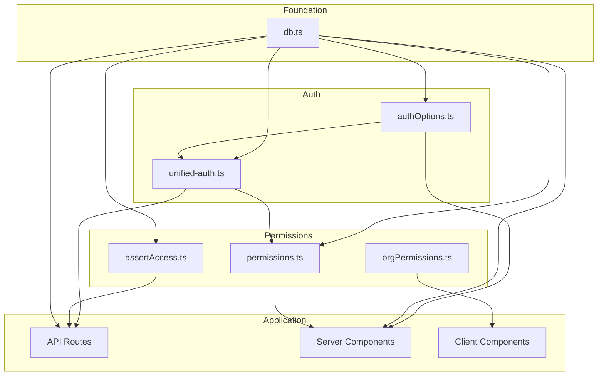

# Loopwell Dependency Map

This document maps the most-imported modules in the codebase, identifies circular dependency risks, and highlights high-risk change zones for parallel development.

**Last Updated:** February 2026

---

## Table of Contents

1. [Top 20 Most-Imported Modules](#top-20-most-imported-modules)
2. [Dependency Hierarchy](#dependency-hierarchy)
3. [Circular Dependency Analysis](#circular-dependency-analysis)
4. [High-Risk Change Zones](#high-risk-change-zones)
5. [Module Categories](#module-categories)
6. [Safe Modification Guidelines](#safe-modification-guidelines)

---

## Top 20 Most-Imported Modules

These modules are imported by many files across the codebase. Changes to these files have a large blast radius.

| Rank | Module | Estimated Imports | Risk Level | Category |
|------|--------|-------------------|------------|----------|
| 1 | `src/lib/db.ts` | 200+ | **Critical** | Data |
| 2 | `src/lib/unified-auth.ts` | 100+ | **Critical** | Auth |
| 3 | `src/lib/utils.ts` | 100+ | Medium | Utility |
| 4 | `src/lib/workspace-context.tsx` | 50+ | High | State |
| 5 | `src/lib/orgPermissions.ts` | 50+ | High | Auth |
| 6 | `src/lib/orgApi.ts` | 50+ | Medium | API |
| 7 | `src/lib/api-errors.ts` | 40+ | Low | Error Handling |
| 8 | `src/lib/logger.ts` | 30+ | Low | Observability |
| 9 | `src/lib/auth/assertAccess.ts` | 30+ | High | Auth |
| 10 | `src/server/authOptions.ts` | 20+ | **Critical** | Auth |
| 11 | `src/lib/permissions.ts` | 20+ | High | Auth |
| 12 | `src/lib/prisma/scopingMiddleware.ts` | 10+ | **Critical** | Data |
| 13 | `src/lib/cache.ts` | 10+ | Low | Performance |
| 14 | `src/lib/pagination.ts` | 10+ | Low | Utility |
| 15 | `src/providers/user-status-provider.tsx` | 10+ | High | State |
| 16 | `src/lib/org/data.server.ts` | 10+ | Medium | Data |
| 17 | `src/lib/org/permissions.server.ts` | 10+ | High | Auth |
| 18 | `src/lib/org/cache.server.ts` | 10+ | Low | Performance |
| 19 | `src/components/ui/button.tsx` | 100+ | Low | UI |
| 20 | `src/components/ui/card.tsx` | 50+ | Low | UI |

### Risk Level Definitions

| Level | Description |
|-------|-------------|
| **Critical** | Changes affect core functionality; require team coordination |
| **High** | Changes may break multiple features; require careful testing |
| **Medium** | Changes have moderate impact; standard review process |
| **Low** | Changes are isolated; normal development workflow |

---

## Dependency Hierarchy

The codebase has a clean, layered dependency structure:

```
┌─────────────────────────────────────────────────────────────┐
│                     FOUNDATION LAYER                         │
├─────────────────────────────────────────────────────────────┤
│  src/lib/db.ts                                              │
│  └── Prisma client singleton                                │
│  └── No dependencies on other src/lib modules               │
└─────────────────────────────────────────────────────────────┘
                              ▲
                              │
┌─────────────────────────────────────────────────────────────┐
│                     AUTH LAYER                               │
├─────────────────────────────────────────────────────────────┤
│  src/lib/unified-auth.ts                                    │
│  └── Depends on: db.ts, authOptions.ts                      │
│                                                             │
│  src/server/authOptions.ts                                  │
│  └── Depends on: db.ts (prismaUnscoped)                     │
└─────────────────────────────────────────────────────────────┘
                              ▲
                              │
┌─────────────────────────────────────────────────────────────┐
│                     PERMISSION LAYER                         │
├─────────────────────────────────────────────────────────────┤
│  src/lib/permissions.ts                                     │
│  └── Depends on: unified-auth.ts, db.ts                     │
│                                                             │
│  src/lib/auth/assertAccess.ts                               │
│  └── Depends on: db.ts                                      │
│                                                             │
│  src/lib/orgPermissions.ts                                  │
│  └── Pure functions, no dependencies                        │
└─────────────────────────────────────────────────────────────┘
                              ▲
                              │
┌─────────────────────────────────────────────────────────────┐
│                     APPLICATION LAYER                        │
├─────────────────────────────────────────────────────────────┤
│  API Routes (src/app/api/**)                                │
│  └── Depend on: unified-auth, assertAccess, db              │
│                                                             │
│  Server Components                                          │
│  └── Depend on: authOptions, db, permissions                │
│                                                             │
│  Client Components                                          │
│  └── Depend on: workspace-context, useSession               │
└─────────────────────────────────────────────────────────────┘
```

### Mermaid Diagram



---

## Circular Dependency Analysis

**Status: No circular dependencies detected**

The codebase maintains a clean dependency hierarchy:

### Verified Safe Patterns

| From | To | Status |
|------|-----|--------|
| `unified-auth.ts` | `db.ts` | Safe (one-way) |
| `permissions.ts` | `unified-auth.ts` | Safe (one-way) |
| `permissions.ts` | `db.ts` | Safe (one-way) |
| `db.ts` | (none) | Safe (foundation) |
| `workspace-context.tsx` | (none from db/auth) | Safe (isolated) |

### Patterns to Avoid

To maintain the clean hierarchy, avoid:

1. **db.ts importing from auth modules** - Would create cycle
2. **authOptions.ts importing from unified-auth.ts** - Would create cycle
3. **assertAccess.ts importing from permissions.ts** - Would create cycle

### Monitoring

If you suspect a circular dependency:

```bash
# Check with TypeScript
npx tsc --noEmit 2>&1 | grep -i "circular"

# Check with madge (if installed)
npx madge --circular src/
```

---

## High-Risk Change Zones

These areas require extra caution when modifying. Changes can cause cascading failures.

### Tier 1: Critical Infrastructure

| File | Risk | Impact |
|------|------|--------|
| `src/lib/db.ts` | **Critical** | All database operations fail |
| `src/lib/unified-auth.ts` | **Critical** | All authenticated API routes fail |
| `src/middleware.ts` | **Critical** | All route protection fails |
| `src/server/authOptions.ts` | **Critical** | All authentication fails |
| `prisma/schema.prisma` | **Critical** | Data model breaks |

**Before changing Tier 1 files:**
- Notify all developers
- Create a feature branch
- Test all auth flows
- Test workspace switching
- Run full E2E suite

### Tier 2: Auth & Permissions

| File | Risk | Impact |
|------|------|--------|
| `src/lib/auth/assertAccess.ts` | High | Permission checks fail |
| `src/lib/permissions.ts` | High | Permission context breaks |
| `src/lib/prisma/scopingMiddleware.ts` | High | Workspace isolation breaks |
| `src/lib/workspace-context.tsx` | High | Client workspace state breaks |
| `src/providers/user-status-provider.tsx` | High | User status breaks |

**Before changing Tier 2 files:**
- Test affected permission flows
- Test workspace switching
- Verify no cross-workspace data leaks

### Tier 3: Feature Modules

| File | Risk | Impact |
|------|------|--------|
| `src/lib/orgApi.ts` | Medium | Org API calls fail |
| `src/lib/orgPermissions.ts` | Medium | Org permission checks fail |
| `src/lib/org/data.server.ts` | Medium | Org data loading fails |
| `src/lib/api-errors.ts` | Low | Error responses change |

**Before changing Tier 3 files:**
- Test affected feature area
- Standard code review

---

## Module Categories

### Data Access

| Module | Purpose | Stability |
|--------|---------|-----------|
| `src/lib/db.ts` | Prisma client singleton | Stable |
| `src/lib/prisma/scoped-prisma.ts` | Workspace-scoped client | Stable |
| `src/lib/prisma/scopingMiddleware.ts` | Auto workspace filtering | Stable |
| `src/lib/db-optimization.ts` | Optimized query helpers | Evolving |
| `src/lib/blog-db.ts` | Blog Prisma client | Stable |

### Authentication

| Module | Purpose | Stability |
|--------|---------|-----------|
| `src/server/authOptions.ts` | NextAuth configuration | Stable |
| `src/lib/unified-auth.ts` | Unified auth for routes | Stable |
| `src/lib/auth/assertAccess.ts` | Access assertion | Stable |
| `src/lib/auth/getCurrentUserId.ts` | User ID retrieval | Stable |

### Workspace & State

| Module | Purpose | Stability |
|--------|---------|-----------|
| `src/lib/workspace-context.tsx` | Client workspace state | Stable |
| `src/lib/workspace-onboarding.ts` | Workspace creation | Stable |
| `src/providers/user-status-provider.tsx` | User status context | Stable |
| `src/lib/redirect-handler.ts` | Client redirect logic | Stable |

### Permissions

| Module | Purpose | Stability |
|--------|---------|-----------|
| `src/lib/permissions.ts` | Permission context | Stable |
| `src/lib/orgPermissions.ts` | Org permission types | Stable |
| `src/lib/org/permissions.server.ts` | Server permission checks | Stable |

### Utilities

| Module | Purpose | Stability |
|--------|---------|-----------|
| `src/lib/utils.ts` | `cn()`, formatters | Stable |
| `src/lib/logger.ts` | Logging system | Stable |
| `src/lib/api-errors.ts` | Error handling | Stable |
| `src/lib/cache.ts` | Caching utilities | Stable |
| `src/lib/pagination.ts` | Pagination helpers | Stable |

### UI Components

| Module | Purpose | Stability |
|--------|---------|-----------|
| `src/components/ui/*` | Base UI primitives | Stable |
| `src/components/org/ui/tokens.ts` | Design tokens | Stable |
| `src/components/org/ui/OrgCard.tsx` | Org card component | Stable |

---

## Safe Modification Guidelines

### Modifying Critical Modules

1. **Create a feature branch**
   ```bash
   git checkout -b fix/critical-module-change
   ```

2. **Document the change**
   - What is changing?
   - Why is it necessary?
   - What could break?

3. **Add/update tests**
   - Unit tests for the module
   - Integration tests for affected flows

4. **Run full verification**
   ```bash
   npm run typecheck
   npm run lint
   npm run test
   npm run test:e2e
   ```

5. **Request review from multiple developers**

### Modifying High-Risk Modules

1. **Test affected flows manually**
2. **Run typecheck and lint**
3. **Request standard code review**

### Modifying Low-Risk Modules

1. **Standard development workflow**
2. **Run typecheck before committing**

---

## Import Analysis Commands

To analyze imports for a specific file:

```bash
# Find all files importing a module
rg "from ['\"]@/lib/db['\"]" src/ --files-with-matches | wc -l

# Find all files importing from a directory
rg "from ['\"]@/lib/auth" src/ --files-with-matches

# Check for potential circular dependencies
npx madge --circular src/lib/
```

---

## Summary

| Category | Count | Risk |
|----------|-------|------|
| Critical modules | 5 | Requires team coordination |
| High-risk modules | 8 | Requires careful testing |
| Medium-risk modules | 10+ | Standard review |
| Low-risk modules | 50+ | Normal workflow |
| Circular dependencies | 0 | Clean hierarchy |

**Key Takeaway:** The codebase has a clean dependency hierarchy with no circular dependencies. The main risk areas are the foundation modules (`db.ts`, `unified-auth.ts`, `authOptions.ts`, `middleware.ts`) which should be treated as stable interfaces.
