# Ops Console Phase 2: Internal Control Plane

## Current State Summary

### Existing Implementation

**Location**: `src/app/ops/page.tsx`

**Current Features**:
- Single-page dashboard (no tabs)
- 4 sections: Bootstrap Performance, Slowest Endpoints, Recent Client Errors, Recent Requests
- Health badges (GOOD/WATCH/BAD) with thresholds
- Interpretation heuristics for latency patterns
- Route drilldown (via `?route=` query param)
- Access control: workspace owners/admins or `OPS_ALLOWED_EMAILS`
- Returns 404 for unauthorized users

**Data Model**: `OpsEvent` in Prisma schema
- Fields: `id`, `createdAt`, `workspaceId`, `userId`, `kind`, `route`, `method`, `status`, `durationMs`, `authDurationMs`, `dbDurationMs`, `meta`
- Indexes: `createdAt`, `(kind, createdAt)`, `(route, createdAt)`
- Enum: `OpsEventKind` (REQUEST_TIMING, CLIENT_ERROR, BOOTSTRAP)

**Instrumentation**:
- `logOpsEvent()` in `src/lib/ops/logger.ts` (non-blocking, fire-and-forget)
- Logging enabled via `OPS_LOGGING_ENABLED=true`
- Currently instrumented routes:
  - `/api/dashboard/bootstrap`
  - `/api/projects` (GET)
  - `/api/todos` (GET)
- Client error reporting via `ErrorReporter` component in root layout

**Access Control**:
- Uses `getUnifiedAuth()` and `getUserWorkspaceRole()`
- Checks workspace role (OWNER/ADMIN) or email allowlist
- Returns 404 (not 403) for unauthorized

**Data Storage**:
- All data stored in `ops_events` table
- Computed on-the-fly: percentiles (P50/P95), aggregations, health status
- Query limits: max 200 rows per query
- Time windows: hardcoded (15m, 1h, 24h)

**What's Missing**:
- No tabs (single long page)
- No refresh mechanism
- No time range selector
- No auto-refresh
- No workspace/user counts
- No AI usage tracking
- No error fingerprinting/grouping

---

## Target Architecture

```mermaid
flowchart TD
    A[User visits /ops] --> B[Access Control Check]
    B -->|Authorized| C[Read Query Params]
    B -->|Unauthorized| D[404]
    C --> E{tab param?}
    E -->|overview| F[Overview Tab]
    E -->|performance| G[Performance Tab]
    E -->|errors| H[Errors Tab]
    E -->|scale| I[Scale Tab]
    E -->|ai-cost| J[AI & Cost Tab]
    E -->|none| F
    F --> K[Fetch Overview Data]
    G --> L[Fetch Performance Data]
    H --> M[Fetch Error Data]
    I --> N[Fetch Scale Data]
    J --> O[Fetch AI Usage Data]
    K --> P[Render with Filters]
    L --> P
    M --> P
    N --> P
    O --> P
    P --> Q[Client Refresh Handler]
    Q -->|Manual| R[router.refresh]
    Q -->|Auto| S[setInterval + router.refresh]
```



---

## Data Models

### Existing: OpsEvent

```prisma
model OpsEvent {
  id            String        @id @default(cuid())
  createdAt     DateTime      @default(now())
  workspaceId   String?
  userId        String?       // Never displayed in UI
  kind          OpsEventKind
  route         String?
  method        String?
  status        Int?
  durationMs    Int?
  authDurationMs Int?
  dbDurationMs  Int?
  meta          Json?

  @@index([createdAt])
  @@index([kind, createdAt])
  @@index([route, createdAt])
  @@map("ops_events")
}

enum OpsEventKind {
  REQUEST_TIMING
  CLIENT_ERROR
  BOOTSTRAP
  AI_USAGE  // NEW: For Phase 6
}
```

### New: AiUsageEvent (Phase 6)

**Option A: Extend OpsEvent** (Recommended)
- Add `AI_USAGE` to `OpsEventKind`
- Use `meta` field for AI-specific data:
  - `feature`: string (e.g., "loopbrain_chat")
  - `tokensIn`: number
  - `tokensOut`: number
  - `model`: string
  - `costUsd`: number (optional)

**Option B: Separate Model** (If needed later)
- Only if we need different indexes or query patterns

**Decision**: Use Option A (extend OpsEvent) for Phase 6.

---

## Query Patterns (All Phases)

### Guardrails (Applied to All Queries)

```typescript
// Time window (required)
const timeWindow = getTimeWindow(range) // 15m, 1h, 24h, 7d

// Row limit (required)
const MAX_ROWS = 500 // Per query

// Minimal select (required)
select: {
  // Only fields needed for display/calculation
  // Never: full user objects, content, PII
}
```

### Index Requirements

Existing indexes are sufficient:
- `createdAt` - for time-based queries
- `(kind, createdAt)` - for filtering by event type
- `(route, createdAt)` - for route-specific queries

**No new indexes needed** for Phase 2.

---

## Phase 1: Ops Console Shell + Refresh UX

### Requirements

1. **Tab Navigation**
   - Use shadcn `Tabs` component
   - Tabs: Overview, Performance, Errors, Scale, AI & Cost
   - URL state: `?tab=performance`
   - Default: `tab=overview`

2. **Top Toolbar**
   - Left: Page title "Ops Console"
   - Right:
     - Time range selector: 15m / 1h / 24h / 7d
     - "Refresh" button
     - "Last refreshed: [timestamp]"
     - Auto-refresh toggle (off by default, 30s interval)

3. **Query String State**
   - `?tab=overview|performance|errors|scale|ai-cost`
   - `?range=15m|1h|24h|7d` (default: 24h for overview, 1h for others)
   - `?route=/api/todos` (for route drilldown)
   - `?workspaceId=xxx` (optional, for workspace filtering)

4. **Refresh Mechanism**
   - Client component wrapper uses `useRouter().refresh()`
   - Server components re-fetch on refresh
   - Auto-refresh: `setInterval` calls `router.refresh()` every 30s
   - Show loading state during refresh

### Implementation Structure

```
src/app/ops/
  page.tsx (server component - main page)
  components/
    ops-toolbar.tsx (client - refresh controls)
    ops-tabs.tsx (client - tab navigation)
    overview-tab.tsx (server - Phase 2)
    performance-tab.tsx (server - Phase 3)
    errors-tab.tsx (server - Phase 4)
    scale-tab.tsx (server - Phase 5)
    ai-cost-tab.tsx (server - Phase 6)
```

### Files to Create/Modify

1. `src/app/ops/page.tsx` - Refactor to use tabs
2. `src/app/ops/components/ops-toolbar.tsx` - New client component
3. `src/app/ops/components/ops-tabs.tsx` - New client component wrapper
4. `src/app/ops/components/overview-tab.tsx` - Placeholder for Phase 2

### Query String Parsing

```typescript
// In page.tsx (server component)
const params = await searchParams
const tab = (params.tab as TabType) || 'overview'
const range = (params.range as TimeRange) || (tab === 'overview' ? '24h' : '1h')
const routeFilter = params.route ? decodeURIComponent(params.route) : null
const workspaceFilter = params.workspaceId || null
```

### Refresh Implementation

```typescript
// ops-toolbar.tsx (client component)
'use client'
import { useRouter, useSearchParams } from 'next/navigation'
import { useState, useEffect } from 'react'

export function OpsToolbar() {
  const router = useRouter()
  const searchParams = useSearchParams()
  const [lastRefreshed, setLastRefreshed] = useState<Date>(new Date())
  const [autoRefresh, setAutoRefresh] = useState(false)

  const handleRefresh = () => {
    router.refresh()
    setLastRefreshed(new Date())
  }

  useEffect(() => {
    if (!autoRefresh) return
    const interval = setInterval(() => {
      router.refresh()
      setLastRefreshed(new Date())
    }, 30000) // 30 seconds
    return () => clearInterval(interval)
  }, [autoRefresh, router])

  // ... render toolbar
}
```

### Deliverables

- ✅ Tabbed interface (5 tabs, Overview default)
- ✅ Time range selector (15m/1h/24h/7d)
- ✅ Refresh button with timestamp
- ✅ Auto-refresh toggle (30s interval)
- ✅ Query string state management
- ✅ No new data yet (shell only)

---

## Phase 2: Overview Tab

### Data Requirements (Last 24h default)

**Aggregated Metrics**:
1. Total workspaces count
2. Total users count
3. Active users (24h / 7d)
4. Requests count (ops events)
5. Error count (client errors)
6. Bootstrap P50/P95
7. Top slow route (by P95)

### Queries

```typescript
// All queries use time window and limits
const timeWindow = getTimeWindow(range) // default 24h

// 1. Workspaces count
const workspaceCount = await prisma.workspace.count()

// 2. Users count
const userCount = await prisma.user.count()

// 3. Active users (24h / 7d)
const activeUsers24h = await prisma.workspaceMember.findMany({
  where: {
    workspace: {
      members: {
        some: {
          // Users with activity in last 24h
        }
      }
    }
  },
  select: { userId: true },
  distinct: ['userId'],
  take: 1000 // limit
})

// 4. Requests count
const requestCount = await prisma.opsEvent.count({
  where: {
    kind: 'REQUEST_TIMING',
    createdAt: { gte: timeWindow.start }
  }
})

// 5. Error count
const errorCount = await prisma.opsEvent.count({
  where: {
    kind: 'CLIENT_ERROR',
    createdAt: { gte: timeWindow.start }
  }
})

// 6. Bootstrap metrics (existing logic)
const bootstrapEvents = await prisma.opsEvent.findMany({
  where: {
    kind: 'REQUEST_TIMING',
    route: '/api/dashboard/bootstrap',
    createdAt: { gte: timeWindow.start }
  },
  select: { durationMs: true },
  take: 500
})
// Calculate P50/P95 in application code

// 7. Top slow route
const allRoutes = await prisma.opsEvent.findMany({
  where: {
    kind: 'REQUEST_TIMING',
    createdAt: { gte: timeWindow.start },
    route: { not: null }
  },
  select: { route: true, durationMs: true },
  take: 500
})
// Group by route, calculate P95, find max
```

### UI Layout

```
[Overview Tab]
├── Key Metrics (grid 2x4)
│   ├── Workspaces: 12
│   ├── Users: 45
│   ├── Active (24h): 23
│   ├── Active (7d): 38
│   ├── Requests: 1,234
│   ├── Errors: 5
│   ├── Bootstrap P50: 150ms [GOOD badge]
│   └── Bootstrap P95: 800ms [GOOD badge]
└── Top Slow Route
    └── /api/todos - P95: 1200ms [WATCH badge]
```

### Safety

- No user emails/names displayed
- Counts only (no individual records)
- Workspace IDs shown as hashed/shortened if needed
- All queries have time windows and row limits

---

## Phase 3: Performance Tab

### Features

1. **Aggregated Table** (grouped by route)
   - Columns: Route, Avg, P50, P95, Max, Count, Status
   - Sortable by P95 (default)
   - Health badges per route

2. **Route Drilldown**
   - Click route → show last 50 requests
   - Breakdown: auth/db/other duration
   - Sorted by duration (largest first)

3. **Health Interpretation**
   - P50/P95 thresholds → badges
   - Heuristic text (existing `interpretLatency` function)

### Queries

```typescript
// Main performance query
const events = await prisma.opsEvent.findMany({
  where: {
    kind: 'REQUEST_TIMING',
    createdAt: { gte: timeWindow.start },
    route: { not: null }
  },
  select: {
    route: true,
    durationMs: true,
    authDurationMs: true,
    dbDurationMs: true,
  },
  take: 500 // Max rows
})

// Group by route in application code
// Calculate percentiles in application code
// Sort by P95 descending
// Limit to top 20 routes
```

### Percentile Calculation

```typescript
function calculatePercentiles(durations: number[], percentile: number): number {
  if (durations.length === 0) return 0
  const sorted = [...durations].sort((a, b) => a - b)
  const index = Math.floor(sorted.length * percentile)
  return sorted[index]
}

// Usage
const p50 = calculatePercentiles(routeDurations, 0.5)
const p95 = calculatePercentiles(routeDurations, 0.95)
```

### UI Structure

```
[Performance Tab]
├── Filters (time range, route search)
├── Aggregated Table
│   └── [Route] [Avg] [P50] [P95] [Max] [Count] [Status]
└── Route Drilldown (when route clicked)
    └── Last 50 requests with breakdown
```

---

## Phase 4: Errors Tab

### Features

1. **Error Fingerprinting**
   - Group by message (first 120 chars)
   - Show: count, first seen, last seen, top routes
   - Sort by count (descending)

2. **Drilldown**
   - Click fingerprint → show last 50 raw events
   - Sanitized (no PII, truncated stack)

### Queries

```typescript
// Fetch errors
const errors = await prisma.opsEvent.findMany({
  where: {
    kind: 'CLIENT_ERROR',
    createdAt: { gte: timeWindow.start }
  },
  select: {
    createdAt: true,
    route: true,
    meta: true,
  },
  take: 500
})

// Group by message fingerprint in application code
// message.substring(0, 120) as fingerprint
// Aggregate: count, firstSeen, lastSeen, routes
```

### UI Structure

```
[Errors Tab]
├── Error Fingerprints Table
│   └── [Message] [Count] [First Seen] [Last Seen] [Top Routes]
└── Error Details (when fingerprint clicked)
    └── Last 50 error events (sanitized)
```

### Safety

- Stack traces truncated to 2000 chars (already in meta)
- Messages truncated to 120 chars for fingerprinting
- No PII in display
- Route shown but not user info

---

## Phase 5: Scale Tab

### Metrics

1. **Totals**
   - Workspaces count
   - Users count
   - Projects count
   - Todos count
   - Wiki pages count
   - Tasks count

2. **Largest Workspace**
   - By users
   - By tasks
   - By pages
   - By projects

### Queries

```typescript
// All queries with strict limits and selects

// Totals
const workspaceCount = await prisma.workspace.count()
const userCount = await prisma.user.count()
const projectCount = await prisma.project.count()
const todoCount = await prisma.todo.count()
const wikiPageCount = await prisma.wikiPage.count()
const taskCount = await prisma.task.count()

// Largest workspace by users
const largestByUsers = await prisma.workspace.findFirst({
  select: {
    id: true,
    name: true,
    _count: { select: { members: true } }
  },
  orderBy: {
    members: { _count: 'desc' }
  }
})

// Similar for tasks, pages, projects
// Use aggregation queries with _count
```

### UI Structure

```
[Scale Tab]
├── Totals Grid
│   └── [Workspaces] [Users] [Projects] [Todos] [Pages] [Tasks]
└── Largest Workspaces
    ├── By Users: [workspace-id-hash] (45 users)
    ├── By Tasks: [workspace-id-hash] (123 tasks)
    ├── By Pages: [workspace-id-hash] (67 pages)
    └── By Projects: [workspace-id-hash] (12 projects)
```

### Safety

- Workspace IDs shown as hashed/shortened (not full ID)
- No workspace names (could be PII)
- Counts only, no individual records
- All queries have limits

---

## Phase 6: AI & Cost Tab

### Data Model Extension

**Extend OpsEvent**:
- Add `AI_USAGE` to `OpsEventKind` enum
- Use existing `meta` field for AI data:
  ```typescript
  meta: {
    feature: 'loopbrain_chat' | 'wiki_summarize' | ...
    tokensIn: number
    tokensOut: number
    model: string
    costUsd?: number // Optional for now
  }
  ```

### Instrumentation Points

**Where to log AI usage**:
- LoopBrain chat: `src/app/api/loopbrain/chat/route.ts`
- Wiki summarize: (if exists)
- Other AI features as they're added

**Logging call**:
```typescript
await logOpsEvent({
  kind: 'AI_USAGE',
  workspaceId: auth.workspaceId,
  userId: auth.user.userId,
  route: '/api/loopbrain/chat',
  meta: {
    feature: 'loopbrain_chat',
    tokensIn: response.usage.input_tokens,
    tokensOut: response.usage.output_tokens,
    model: 'gpt-4-turbo',
    // costUsd: calculateCost(...) // Phase 6.1
  }
})
```

### Queries

```typescript
// AI usage events
const aiEvents = await prisma.opsEvent.findMany({
  where: {
    kind: 'AI_USAGE',
    createdAt: { gte: timeWindow.start }
  },
  select: {
    createdAt: true,
    workspaceId: true,
    userId: true,
    route: true,
    meta: true,
  },
  take: 500
})

// Aggregate in application code:
// - Total tokens (today/7d/30d)
// - By user (top token users)
// - By workspace (top token workspaces)
// - By feature (per-feature breakdown)
```

### UI Structure

```
[AI & Cost Tab]
├── Totals
│   ├── Today: 45,234 tokens
│   ├── 7d: 234,567 tokens
│   └── 30d: 1,234,567 tokens
├── Top Token Users
│   └── [user-id-hash] - 12,345 tokens
├── Top Token Workspaces
│   └── [workspace-id-hash] - 23,456 tokens
└── Per-Feature Breakdown
    ├── loopbrain_chat: 100,000 tokens
    └── wiki_summarize: 50,000 tokens
```

### Safety

- User/workspace IDs shown as hashed (not full ID)
- No user emails/names
- Token counts only
- Cost calculation deferred (Phase 6.1)

---

## Implementation Phases

### Phase 1: Shell + Refresh UX
**Status**: Ready to implement
**Files**:
- `src/app/ops/page.tsx` - Refactor to tabs
- `src/app/ops/components/ops-toolbar.tsx` - New
- `src/app/ops/components/ops-tabs.tsx` - New

### Phase 2: Overview Tab
**Status**: After Phase 1 approval
**Files**:
- `src/app/ops/components/overview-tab.tsx` - New

### Phase 3: Performance Tab
**Status**: After Phase 2
**Files**:
- `src/app/ops/components/performance-tab.tsx` - New
- Refactor existing performance logic from `page.tsx`

### Phase 4: Errors Tab
**Status**: After Phase 3
**Files**:
- `src/app/ops/components/errors-tab.tsx` - New
- Error fingerprinting logic

### Phase 5: Scale Tab
**Status**: After Phase 4
**Files**:
- `src/app/ops/components/scale-tab.tsx` - New

### Phase 6: AI & Cost Tab
**Status**: After Phase 5
**Files**:
- `src/app/ops/components/ai-cost-tab.tsx` - New
- Update `OpsEventKind` enum
- Add instrumentation to AI routes
- Update `logOpsEvent` to support AI_USAGE

---

## Query Helper Functions

### Time Window Helper

```typescript
type TimeRange = '15m' | '1h' | '24h' | '7d'

function getTimeWindow(range: TimeRange): { start: Date; end: Date } {
  const now = new Date()
  const ms = {
    '15m': 15 * 60 * 1000,
    '1h': 60 * 60 * 1000,
    '24h': 24 * 60 * 60 * 1000,
    '7d': 7 * 24 * 60 * 60 * 1000,
  }[range]
  
  return {
    start: new Date(now.getTime() - ms),
    end: now,
  }
}
```

### Percentile Helper

```typescript
function calculatePercentiles(values: number[], percentile: number): number | null {
  if (values.length === 0) return null
  const sorted = [...values].filter(v => v !== null).sort((a, b) => a - b)
  if (sorted.length === 0) return null
  const index = Math.floor(sorted.length * percentile)
  return sorted[index]
}
```

### Hash Helper (for displaying IDs safely)

```typescript
function hashId(id: string): string {
  // Simple hash for display (not cryptographic)
  // Show first 8 chars + last 4 chars
  if (id.length <= 12) return id.substring(0, 8)
  return `${id.substring(0, 8)}...${id.substring(id.length - 4)}`
}
```

---

## Access Control (Tighten if Needed)

**Current**: Workspace owners/admins OR `OPS_ALLOWED_EMAILS`

**Recommendation**: Keep as-is, but add logging:
```typescript
if (!isAllowed) {
  logger.warn('Unauthorized ops console access attempt', {
    email: auth.user.email,
    userId: auth.user.userId,
    role: userRole,
  })
  notFound()
}
```

---

## Performance Considerations

1. **Query Limits**: All queries max 500 rows
2. **Time Windows**: Bounded (15m to 7d max)
3. **Minimal Selects**: Only fields needed
4. **No N+1 Queries**: Use aggregations where possible
5. **Client-Side Refresh**: Uses Next.js router.refresh() (server-side re-fetch)
6. **Auto-Refresh**: 30s interval (reasonable for ops console)

---

## Documentation Updates

Update `docs/OPS_CONSOLE.md` with:
- New tabs structure
- Time range selector
- Refresh mechanism
- New tabs (Overview, Performance, Errors, Scale, AI & Cost)
- Updated query limits (500 rows)
- New environment variables (if any)

---

## Verification Checklist

After each phase:
- [ ] `npm run build` succeeds
- [ ] `npm run lint` passes
- [ ] `/ops` page loads
- [ ] Tabs work
- [ ] Refresh works
- [ ] Time range selector works
- [ ] Auto-refresh works (if enabled)
- [ ] No PII displayed
- [ ] Unauthorized users get 404
- [ ] Queries have limits and time windows

---

## Next Steps

1. **Review this plan**
2. **Approve Phase 1 implementation**
3. **Implement Phase 1 only**
4. **Stop and report before Phase 2**

