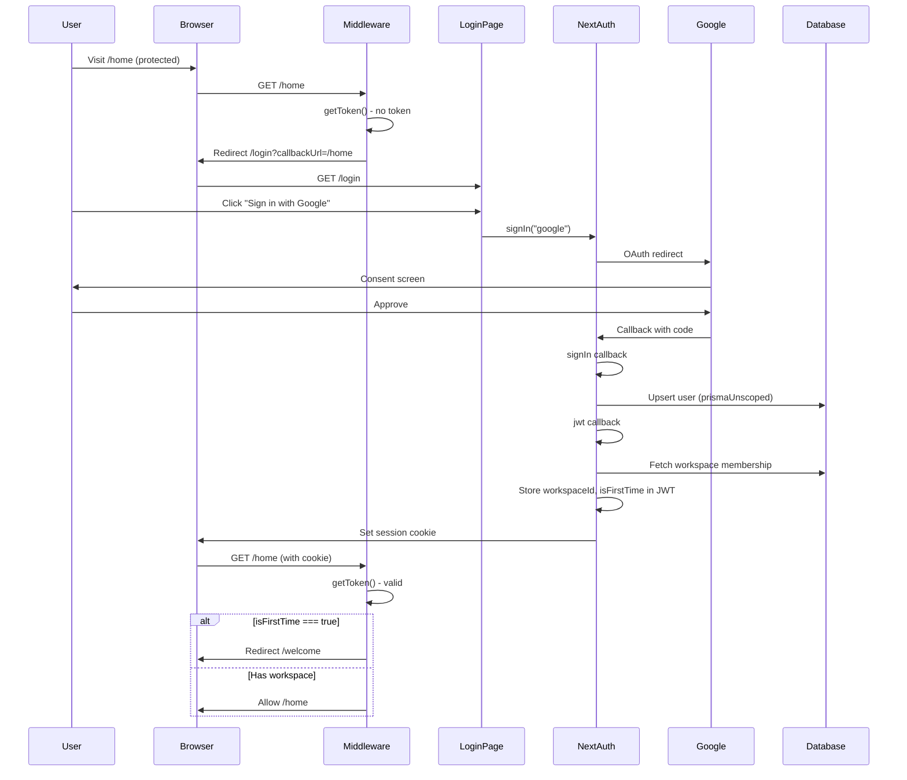
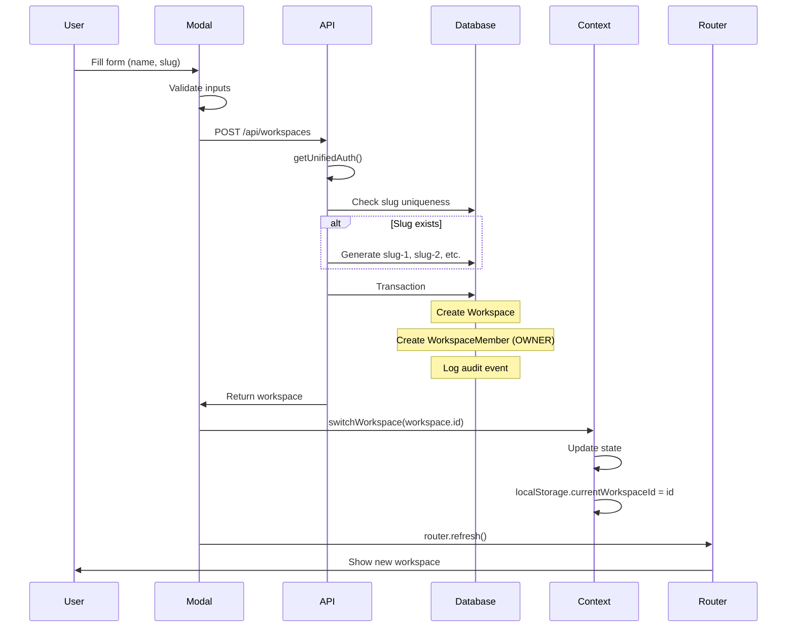
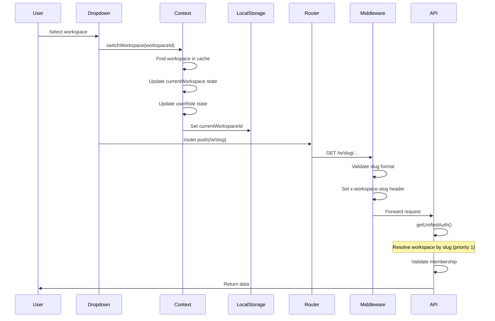
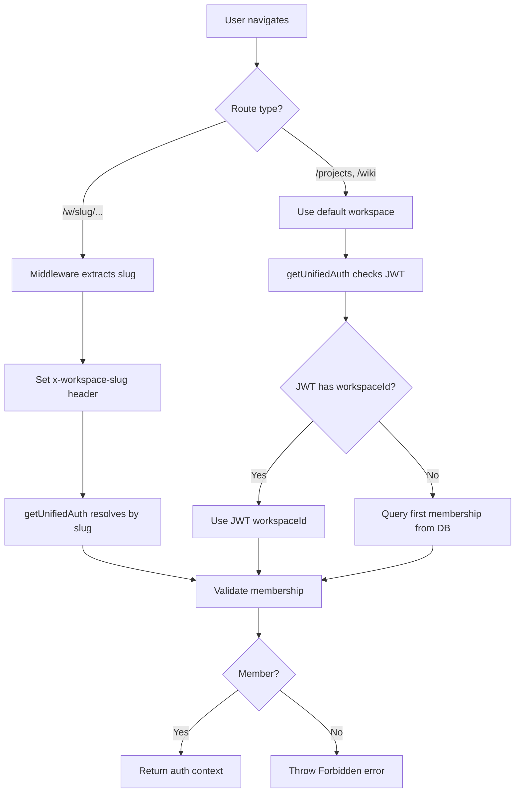
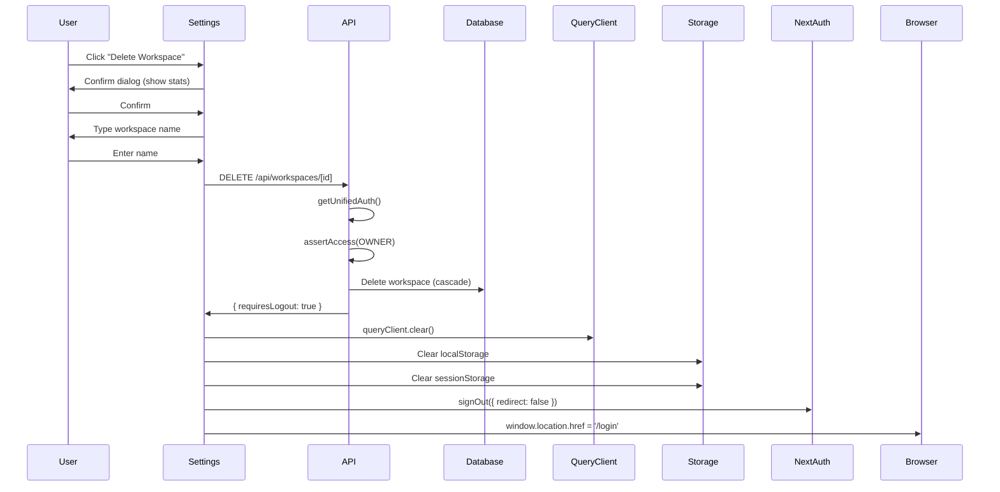
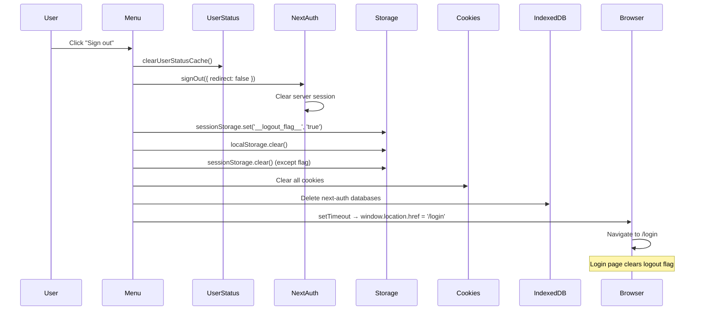

# Workspace & Session Lifecycle

This document describes the complete lifecycle of authentication, workspace management, and session handling in Loopwell. Use this as a reference when working on auth-related features.

**Last Updated:** February 2026

---

## Table of Contents

1. [Login Flow](#login-flow)
2. [Create Workspace Flow](#create-workspace-flow)
3. [Select/Switch Workspace Flow](#selectswitch-workspace-flow)
4. [Navigation Flow](#navigation-flow)
5. [Delete Workspace Flow](#delete-workspace-flow)
6. [Logout Flow](#logout-flow)
7. [Current Deviations & Known Issues](#current-deviations--known-issues)
8. [Key Files Reference](#key-files-reference)

---

## Login Flow

### Sequence Diagram



### Step-by-Step

1. **User visits protected route** (`/home`, `/projects`, etc.)

2. **Middleware intercepts** (`src/middleware.ts:63-67`)
   - Calls `getToken()` to check for valid JWT
   - No token → redirect to `/login?callbackUrl=/home`

3. **User clicks "Sign in with Google"** (`src/app/login/page.tsx`)
   - Triggers `signIn("google")` from `next-auth/react`

4. **Google OAuth flow**
   - User redirected to Google consent screen
   - User approves access
   - Google redirects back with authorization code

5. **NextAuth `signIn` callback** (`src/server/authOptions.ts:60-133`)
   ```typescript
   async signIn({ user, account }) {
     // Upsert user in database
     await prismaUnscoped.user.upsert({
       where: { email: user.email },
       update: { name: user.name, image: user.image },
       create: { email: user.email, name: user.name, image: user.image }
     })
     return true
   }
   ```

6. **NextAuth `jwt` callback** (`src/server/authOptions.ts:169-315`)
   ```typescript
   async jwt({ token, user, trigger, session }) {
     // On initial login
     if (user) {
       token.sub = user.id
       // Fetch workspace membership
       const membership = await prismaUnscoped.workspaceMember.findFirst({
         where: { userId: user.id },
         orderBy: { joinedAt: 'asc' }
       })
       if (membership) {
         token.workspaceId = membership.workspaceId
         token.role = membership.role
         token.isFirstTime = false
       } else {
         token.isFirstTime = true
       }
     }
     return token
   }
   ```

7. **NextAuth `session` callback** (`src/server/authOptions.ts:134-168`)
   ```typescript
   async session({ session, token }) {
     session.user.id = token.sub
     session.user.workspaceId = token.workspaceId
     session.user.role = token.role
     session.user.isFirstTime = token.isFirstTime
     return session
   }
   ```

8. **Session cookie set**
   - HTTP-only cookie: `next-auth.session-token`
   - Contains encrypted JWT

9. **Middleware checks `isFirstTime`** (`src/middleware.ts:72-78`)
   - `isFirstTime === true` → redirect to `/welcome`
   - Has workspace → allow access

---

## Create Workspace Flow

### Sequence Diagram



### Step-by-Step

1. **User opens workspace creation modal** (`src/components/ui/workspace-creation-modal.tsx`)

2. **User fills form**
   - Name (required, min 3 chars)
   - Slug (auto-generated from name, min 3 chars)
   - Description (optional)

3. **Client-side validation**
   ```typescript
   if (name.length < 3) return error
   if (slug.length < 3) return error
   ```

4. **API call** (`POST /api/workspaces`)
   ```typescript
   const response = await fetch('/api/workspaces', {
     method: 'POST',
     body: JSON.stringify({ name, slug, description })
   })
   ```

5. **Server validation** (`src/app/api/workspaces/route.ts:61-151`)
   ```typescript
   // Check auth
   const auth = await getUnifiedAuth(request)
   
   // Validate required fields
   if (!name || !slug) return error
   
   // Check slug uniqueness, append counter if needed
   let finalSlug = slug
   let counter = 0
   while (await prisma.workspace.findUnique({ where: { slug: finalSlug } })) {
     counter++
     finalSlug = `${slug}-${counter}`
   }
   ```

6. **Database transaction**
   ```typescript
   const workspace = await prisma.$transaction(async (tx) => {
     // Create workspace
     const ws = await tx.workspace.create({
       data: { name, slug: finalSlug, description, ownerId: auth.user.userId }
     })
     
     // Create membership
     await tx.workspaceMember.create({
       data: { workspaceId: ws.id, userId: auth.user.userId, role: 'OWNER' }
     })
     
     // Audit log
     await logOrgAuditEvent({ action: 'ORG_CREATED', ... })
     
     return ws
   })
   ```

7. **Client handles success** (`src/components/ui/workspace-creation-modal.tsx`)
   ```typescript
   // Switch to new workspace
   switchWorkspace(data.workspace.id)
   
   // Refresh to update context
   router.refresh()
   
   // Close modal
   onClose()
   ```

---

## Select/Switch Workspace Flow

### Sequence Diagram



### Step-by-Step

1. **User opens workspace dropdown** (`src/components/layout/workspace-account-menu.tsx`)

2. **User selects workspace**
   ```typescript
   const handleSwitchWorkspace = (workspaceId: string) => {
     const workspace = workspaces.find(w => w.id === workspaceId)
     if (workspace) {
       switchWorkspace(workspaceId)
       router.push(`/w/${workspace.slug}`)
       setIsOpen(false)
     }
   }
   ```

3. **Context updates** (`src/lib/workspace-context.tsx:187-209`)
   ```typescript
   const switchWorkspace = (workspaceId: string) => {
     const workspace = workspaces.find(w => w.id === workspaceId)
     if (workspace) {
       setCurrentWorkspace(workspace)
       setUserRole(workspace.role)
       localStorage.setItem('currentWorkspaceId', workspaceId)
     }
   }
   ```

4. **Router navigates** to `/w/[workspaceSlug]/...`

5. **Middleware validates** (`src/middleware.ts:87-113`)
   ```typescript
   const slugMatch = pathname.match(/^\/w\/([^\/]+)/)
   if (slugMatch) {
     const workspaceSlug = slugMatch[1]
     // Validate format
     if (!/^[a-z0-9-]+$/.test(workspaceSlug)) {
       return NextResponse.json({ error: 'Invalid slug' }, { status: 404 })
     }
     // Set header for downstream
     requestHeaders.set('x-workspace-slug', workspaceSlug)
   }
   ```

6. **API resolves workspace** (`src/lib/unified-auth.ts`)
   
   Priority order:
   1. URL path slug (`/w/[workspaceSlug]/...`) - **highest**
   2. URL query params (`?workspaceId=...`)
   3. `x-workspace-id` header
   4. User's default workspace (from JWT or DB)

---

## Navigation Flow

### How Workspace Context is Maintained



### Workspace Resolution in `getUnifiedAuth`

```typescript
// Priority 1: URL path slug
const slugMatch = pathname.match(/^\/w\/([^\/]+)/)
if (slugMatch) {
  const workspace = await prisma.workspace.findUnique({
    where: { slug: slugMatch[1] }
  })
  // Validate membership
  const member = await prisma.workspaceMember.findUnique({
    where: { workspaceId_userId: { workspaceId: workspace.id, userId } }
  })
  if (member) return { workspaceId: workspace.id, ... }
}

// Priority 2: Query params
const workspaceId = searchParams.get('workspaceId')
if (workspaceId) {
  // Validate membership and return
}

// Priority 3: Header
const headerWorkspaceId = headers.get('x-workspace-id')
if (headerWorkspaceId) {
  // Validate membership and return
}

// Priority 4: Default (JWT or first membership)
const jwtWorkspaceId = session.user.workspaceId
if (jwtWorkspaceId) {
  // Validate membership and return
}

// Fallback: Query first membership
const membership = await prisma.workspaceMember.findFirst({
  where: { userId },
  orderBy: { joinedAt: 'asc' }
})
```

---

## Delete Workspace Flow

### Sequence Diagram



### Step-by-Step

1. **User clicks "Delete Workspace"** (`src/app/(dashboard)/w/[workspaceSlug]/settings/page.tsx:312-384`)

2. **First confirmation** (window.confirm with stats)
   ```typescript
   const confirmed = window.confirm(
     `Are you sure you want to delete "${workspace.name}"?\n\n` +
     `This will permanently delete:\n` +
     `- ${memberCount} members\n` +
     `- ${projectCount} projects\n` +
     `- ${taskCount} tasks\n` +
     `- ${wikiPageCount} wiki pages`
   )
   ```

3. **Second confirmation** (type workspace name)
   ```typescript
   const typedName = window.prompt(
     `Type "${workspace.name}" to confirm deletion:`
   )
   if (typedName !== workspace.name) return
   ```

4. **API call** (`DELETE /api/workspaces/[workspaceId]`)
   ```typescript
   const response = await fetch(`/api/workspaces/${workspaceId}`, {
     method: 'DELETE'
   })
   ```

5. **Server validation** (`src/app/api/workspaces/[workspaceId]/route.ts:184-243`)
   ```typescript
   // Verify auth
   const auth = await getUnifiedAuth(request)
   
   // Require OWNER role
   await assertAccess({
     userId: auth.user.userId,
     workspaceId,
     scope: 'workspace',
     requireRole: ['OWNER']
   })
   
   // Delete workspace (cascade deletes related data)
   await prisma.workspace.delete({
     where: { id: workspaceId }
   })
   
   return NextResponse.json({
     message: 'Workspace deleted',
     deletedWorkspace: { id, name, slug },
     requiresLogout: true
   })
   ```

6. **Client cleanup** (`src/app/(dashboard)/w/[workspaceSlug]/settings/page.tsx`)
   ```typescript
   // Clear React Query cache
   queryClient.clear()
   
   // Clear localStorage
   localStorage.removeItem('currentWorkspaceId')
   localStorage.removeItem('workspace-data')
   
   // Clear sessionStorage
   sessionStorage.clear()
   
   // Sign out
   await signOut({ redirect: false })
   
   // Hard redirect
   window.location.href = '/login'
   ```

---

## Logout Flow

### Sequence Diagram



### Step-by-Step

1. **User clicks "Sign out"** (`src/components/layout/workspace-account-menu.tsx:121-184`)

2. **Clear user status cache**
   ```typescript
   clearUserStatusCache()
   ```

3. **Sign out from NextAuth**
   ```typescript
   await signOut({ redirect: false })
   ```

4. **Set logout flag** (prevents stale state)
   ```typescript
   sessionStorage.setItem('__logout_flag__', 'true')
   ```

5. **Clear localStorage**
   ```typescript
   localStorage.clear()
   ```

6. **Clear sessionStorage** (except logout flag)
   ```typescript
   Object.keys(sessionStorage).forEach(key => {
     if (key !== '__logout_flag__') {
       sessionStorage.removeItem(key)
     }
   })
   ```

7. **Clear cookies**
   ```typescript
   document.cookie.split(';').forEach(cookie => {
     const name = cookie.split('=')[0].trim()
     document.cookie = `${name}=; expires=Thu, 01 Jan 1970 00:00:00 GMT; path=/`
   })
   ```

8. **Clear IndexedDB** (NextAuth may store data here)
   ```typescript
   const databases = await indexedDB.databases()
   databases.forEach(db => {
     if (db.name?.includes('next-auth')) {
       indexedDB.deleteDatabase(db.name)
     }
   })
   ```

9. **Hard redirect**
   ```typescript
   setTimeout(() => {
     window.location.href = '/login'
   }, 100)
   ```

10. **Login page clears logout flag** (`src/app/login/page.tsx`)
    ```typescript
    useEffect(() => {
      sessionStorage.removeItem('__logout_flag__')
    }, [])
    ```

---

## Current Deviations & Known Issues

### 1. Logout Flag Workaround

**Issue:** After signing out, stale session state can persist in React components, causing redirect loops or showing cached data.

**Workaround:** The `__logout_flag__` in sessionStorage signals to layouts that a logout is in progress. Layouts check for this flag and skip auth checks.

**Files affected:**
- `src/app/(dashboard)/DashboardLayoutClient.tsx:59-73`
- `src/app/(dashboard)/layout.tsx:60-73`
- `src/app/home/layout.tsx:22-30`

**Ideal fix:** Improve session invalidation to immediately clear all client state.

### 2. CI Checks with `continue-on-error: true`

**Issue:** TypeScript and ESLint checks run with `continue-on-error: true` in CI due to pre-existing errors.

**Location:** `.github/workflows/quality-gate.yml:16, 35, 54`

**Impact:** New type errors or lint issues may not block PRs.

**Ideal fix:** Fix pre-existing errors and remove `continue-on-error`.

### 3. Prisma Workspace Scoping Feature-Flagged

**Issue:** Automatic workspace scoping via Prisma middleware is disabled by default.

**Location:** `src/lib/prisma/scopingMiddleware.ts`

**Current practice:** All queries must include explicit `where: { workspaceId }` filters.

**Risk:** Missing filter could leak data across workspaces.

**Ideal fix:** Enable workspace scoping middleware after thorough testing.

### 4. Session JWT Contains Workspace Data

**Issue:** Workspace ID is stored in JWT, which doesn't update when workspace membership changes (until next login).

**Location:** `src/server/authOptions.ts:169-315`

**Workaround:** `getUnifiedAuth()` validates membership on every request, not just JWT.

**Impact:** Minor - stale JWT workspaceId is overridden by membership validation.

### 5. Multiple Workspace Resolution Paths

**Issue:** Workspace can be resolved from URL slug, query params, headers, or JWT. This complexity can cause confusion.

**Location:** `src/lib/unified-auth.ts:321-492`

**Mitigation:** Clear priority order documented above.

---

## Key Files Reference

### Authentication

| File | Purpose |
|------|---------|
| `src/server/authOptions.ts` | NextAuth configuration, callbacks |
| `src/app/api/auth/[...nextauth]/route.ts` | NextAuth API handler |
| `src/middleware.ts` | Route protection, redirects |
| `src/lib/unified-auth.ts` | Unified auth for API routes |
| `src/lib/auth/assertAccess.ts` | Permission assertion |

### Workspace Management

| File | Purpose |
|------|---------|
| `src/app/api/workspaces/route.ts` | Create workspace API |
| `src/app/api/workspaces/[workspaceId]/route.ts` | Get/Update/Delete workspace API |
| `src/lib/workspace-context.tsx` | Client workspace state |
| `src/lib/workspace-onboarding.ts` | Workspace creation helpers |
| `src/components/ui/workspace-creation-modal.tsx` | Creation UI |

### Session & State

| File | Purpose |
|------|---------|
| `src/providers/user-status-provider.tsx` | User status context |
| `src/lib/redirect-handler.ts` | Client redirect logic |
| `src/components/layout/workspace-account-menu.tsx` | Logout, workspace switching |

### Settings & Deletion

| File | Purpose |
|------|---------|
| `src/app/(dashboard)/w/[workspaceSlug]/settings/page.tsx` | Workspace settings, deletion |
| `src/components/org/danger-zone.tsx` | Alternative deletion UI |

---

## Testing Checklist

When modifying auth or workspace flows, test:

- [ ] Login with Google OAuth
- [ ] First-time user redirected to `/welcome`
- [ ] Create workspace from welcome page
- [ ] Create workspace from dropdown
- [ ] Switch between workspaces
- [ ] Navigate to workspace-scoped routes (`/w/slug/...`)
- [ ] Delete workspace (as owner)
- [ ] Logout clears all state
- [ ] Login after logout works correctly
- [ ] Protected routes redirect unauthenticated users
- [ ] API routes return 401 for unauthenticated requests
- [ ] API routes return 403 for unauthorized workspace access
